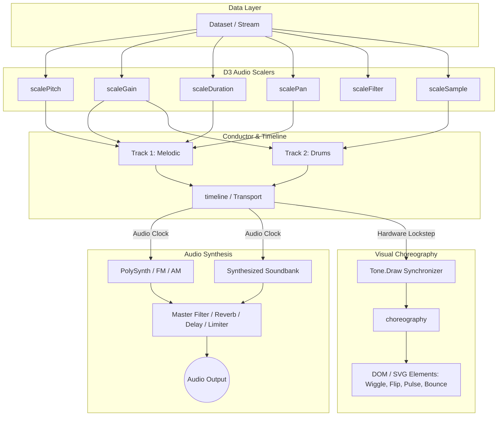
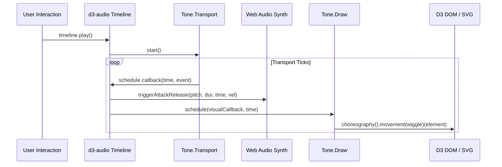

# d3-audio 🎵⚡

> **Audio-Visual Data Sonification and Rhythmic Choreography for D3.js and Tone.js**

[](LICENSE)
[](#-unit-tests--verification)
[](#-running-with-docker)
[](https://d3js.org/)
[](https://tonejs.github.io/)

`d3-audio` is a modular, idiomatic D3 library that bridges data visualization with Web Audio synthesis and rhythmic screen choreography. It introduces **D3-style audio scalers** that map data to musical pitches, frequencies, filter cutoffs, and drum samples—analogous to how D3 scales map data to visual dimensions—while driving **rhythmic physical movements** (wiggles, 3D flips, pulses, bounces, shakes, ripples, glows, and squash & stretch) synchronized frame-accurately to Tone.js timelines.

---

## 📑 Table of Contents

- [Conceptual Model & Architecture](#-conceptual-model--architecture)
- [Principles of Data Sonification](#-principles-of-data-sonification)
- [Continuous, Ordinal, and Categorical Data Sonification](#-continuous-ordinal-and-categorical-data-sonification)
- [Musical Tension, Release & Energy Dynamics](#-musical-tension-release--energy-dynamics)
- [Key Features](#-key-features)
- [Quickstart Guide](#-quickstart-guide)
- [Interactive Demo Applications](#-interactive-demo-applications)
- [Interactive Audio Legend (`audioLegend`)](#-interactive-audio-legend-audiolegend)
- [D3 Audio Scalers Reference](#-d3-audio-scalers-reference)
  - [`scalePitch()`](#scalepitch)
  - [`scaleGain()`](#scalegain)
  - [`scaleDuration()`](#scaleduration)
  - [`scalePan()`](#scalepan)
  - [`scaleFilter()`](#scalefilter)
  - [`scaleSample()`](#scalesample)
  - [`scaleTempo()`](#scaletempo)
  - [`scaleTension()`](#scaletension)
- [Rhythmic Movements & Choreography](#-rhythmic-movements--choreography)
  - [Movement Presets](#movement-presets)
  - [`choreography()` Engine](#choreography-engine)
  - [ADSR Motion Envelopes & Custom Physics](#adsr-motion-envelopes--custom-physics)
- [Timeline & Multi-Track Conductor](#-timeline--multi-track-conductor)
  - [`timeline()`](#timeline)
  - [`Track`](#track)
- [Audio Synthesis & Built-in Soundbanks](#-audio-synthesis--built-in-soundbanks)
- [Step-by-Step Recipes](#-step-by-step-recipes)
- [Running with Docker](#-running-with-docker)
- [Repository Structure](#-repository-structure)
- [Unit Tests & Verification](#-unit-tests--verification)

---

## 🧠 Conceptual Model & Architecture

In traditional D3 visualizations, continuous or discrete data values are transformed into visual attributes like position, radius, color, or opacity:

$$\text{Data Domain} \xrightarrow{\text{D3 Visual Scale}} \text{Visual Range (pixels, RGB, coordinates)}$$

`d3-audio` extends this paradigm to the auditory and kinetic dimensions:

$$\text{Data Domain} \xrightarrow{\text{D3 Audio Scaler}} \text{Sonic Range (Pitch, Gain, Pan, Cutoff, Drum Samples)}$$
$$\text{Data Event} \xrightarrow{\text{Tone.js Timeline} + \text{Tone.Draw}} \text{Synchronized Rhythmic Choreography (Wiggles, Flips, Pulses)}$$



---

## 📜 Principles of Data Sonification

Inspired by foundational research and practice in data musicology (including Daniel Muldrew's *"Transforming Data Into Music"*):

### 1. The Meaning Equation
$$\text{Data} + \text{Known Mapping} = \textbf{Meaning}$$
$$\text{Data} + \text{Cryptic Mapping} = \textbf{Noise / Junk}$$

Just as an unlabeled visual chart produces confusion, sonification without an explicit mapping key is merely noise. A listener must understand *which* physical or musical property corresponds to *which* data dimension. `d3-audio` provides the `audioLegend()` component to make auditory mappings as explicit and interactive as visual axis ticks.

### 2. The "Stay Close to the Data" Rule
> *"Stay close to the data... otherwise it's art!"*

Artistic sonification allows arbitrary aesthetic choices. Analytical sonification demands faithfulness to the data: relative intervals, ratios, and categorical distinctions must be audibly preserved so that a blind or eyes-free user can reconstruct the underlying dataset directly from the sound.

### 3. Why Turn Data Into Sound?
* **Accessibility (a11y)**: Empowers blind and vision-impaired analysts to explore high-dimensional data, distributions, and trends without relying on visual charts or slow screen-reader tabular readouts.
* **Dual-Channel Perception**: Combining sight and sound dramatically accelerates pattern recognition and cognitive retention, revealing subtle periodic cycles or outliers that visual clutter obscures.
* **Eyes-Free & Ambient Telemetry**: Monitoring production server health, financial trading volatility, or medical patient vitals while the user is visually occupied with other tasks.
* **Emotional Resonance & Behavioral Motivation**: Audio connects emotionally. Applications sonifying personal health metrics (sleep regularity, fitness, carbon footprints) can use harmonic consonance as positive reinforcement and dissonance to encourage corrective habits.

---

## 📊 Continuous, Ordinal, and Categorical Data Sonification

Choosing the right auditory dimension depends strictly on the statistical data type of your variable:

```
┌───────────────────────┬───────────────────────────┬───────────────────────────────────────────┐
│ Data Variable Type    │ Visual Attribute          │ Auditory Attribute (`d3-audio` Scaler)    │
├───────────────────────┼───────────────────────────┼───────────────────────────────────────────┤
│ Continuous / Quant    │ Position (X, Y)           │ Sound Frequency / Pitch (`scalePitch`)    │
│ Continuous / Quant    │ Luminosity / Opacity      │ Sound Loudness (`scaleGain`)              │
│ Continuous / Quant    │ Color Temperature         │ Timbre / Filter Brightness (`scaleFilter`)│
│ Continuous / Quant    │ Horizontal Position       │ Stereo Spatial Panning (`scalePan`)       │
│ Continuous / Quant    │ Width / Size              │ Note Duration (`scaleDuration`)           │
├───────────────────────┼───────────────────────────┼───────────────────────────────────────────┤
│ Ordinal (Ranked)      │ Grid Order / Step Rank    │ Diatonic Scale Degrees (`scalePitch`)     │
│ Ordinal (Ranked)      │ Concentric Octave Tiers   │ Octave Register (C3 ➔ C4 ➔ C5)            │
│ Ordinal (Ranked)      │ Threat / Severity Level   │ Harmonic Tension (`scaleTension`)         │
├───────────────────────┼───────────────────────────┼───────────────────────────────────────────┤
│ Categorical (Classes) │ Color Hue (Red, Blue)     │ Instrument Timbre / Synthesizer Voice     │
│ Categorical (Classes) │ Visual Texture / Shape    │ Percussion Sample (`scaleSample`)         │
│ Categorical (Classes) │ Category Clusters         │ Modal Key Center / Scale Mode             │
└───────────────────────┴───────────────────────────┴───────────────────────────────────────────┘
```

### Continuous Data (Quantitative Ranges)
* **Definition**: Numeric values with infinite smooth gradations (e.g. temperatures, stock prices, velocities, geographical coordinates, chemical hydropathy).
* **Sonic Mappings**: Smooth frequency sweeps, continuous dB gain scaling, stereo panning ($-1$ Left to $+1$ Right), and lowpass filter cutoffs ($200\text{ Hz}$ to $10,000\text{ Hz}$).
* **Best Scalers**: `scalePitch().quantize(false)`, `scaleGain()`, `scaleFilter()`, `scalePan()`, `scaleDuration()`.

### Ordinal Data (Ranked Categories)
* **Definition**: Discrete classes that possess a strict, meaningful sequence or hierarchy (e.g. IUCN conservation risk levels, customer satisfaction $1\dots5$, earthquake magnitude classes, educational tiers).
* **Sonic Mappings**: Quantized musical scale degrees (e.g. Root $\rightarrow$ 2nd $\rightarrow$ 3rd $\rightarrow$ 5th $\rightarrow$ 6th in Pentatonic), discrete octave shifts, and progression through harmonic tension tiers.
* **Best Scalers**: `scalePitch().quantize(true)`, `scaleTension()`.

### Categorical Data (Unranked Discrete Groups)
* **Definition**: Discrete categories with **no intrinsic numerical ranking** (e.g. 20 amino acid biochemical families, DNA base pairs A/T/C/G, wildlife taxonomic kingdoms, vehicle fleet dispatch categories, server cluster regions).
* **Sonic Mappings**:
  * **Instrument Timbre**: Assigning fundamentally different synthesis engines or physical acoustic models (e.g. Plucked Kalimba for herbivores, Resonant FM Lead for carnivores, Sub Horn for apex predators, Woodblock click for glycine hinges).
  * **Acoustic Percussion Soundbanks**: Using discrete percussion hits via `scaleSample()` (Kick, Snare, Hi-hat, Bell, Clap, Blip).
  * **Modal Signatures**: Modulating musical modes across categories (e.g. Dorian mode for rainforests, Lydian mode for ocean reefs, Hirajoshi for arctic tundra).
* ⚠️ **Critical Sonification Pitfall**: **Never map non-ranked categories to a single continuous pitch scale!** High notes psychoacoustically imply "greater than" or "higher priority." Mapping categorical variables (such as hair color or department names) to ascending pitches creates false perceived hierarchies. Use distinct instrument timbres, sample hits, or spatial pan positions instead.

---

## ⚡ Musical Tension, Release & Energy Dynamics

Volatile time series, risk anomalies, and system alerts benefit from psychoacoustic tension/release cycles:

* **Tension**: Analogous to the windup of a mechanical spring. Created by harmonic dissonance (tritones, minor 2nds, diminished 7ths), accelerating tempo, rising register, or microtonal detuning.
* **Release**: The return to equilibrium and harmonic stability (consonant major triads, perfect 5ths, octaves) when metrics return within normal operating bounds.
* **Musical Energy**:
  $$\text{Energy} = \text{Loudness (Gain)} \times \text{Speed (BPM)}$$
  As volatility surges, increasing both loudness and tempo magnifies user urgency without requiring visual attention.
* **`scaleTension()`**: Coordinates harmonic chord voicing, filter cutoff, detuning cents, and tempo multipliers from a single continuous risk metric.

---

## ⚖️ Ethical Sonification Guidelines & Preventing Data Misrepresentation

While sonification offers remarkable communicative power, it also introduces unique psychoacoustic and perceptual vulnerabilities. Analysts must design sonifications carefully to avoid unintentionally misleading the listener:

### 1. The "Cherry-Picked Scale" Hazard
* **The Problem**: Selecting a universally consonant scale like **Pentatonic Major** guarantees that *any* data sequence—even completely random white noise or chaotic market volatility—will sound pleasing, melodic, and calm.
* **The Risk**: Dangerously masks real system instability, erratic anomalies, or high variance that *should* sound jarring or dissonant.
* **The Solution**: For volatile or error-prone metrics, pair anomalous values with dissonant harmonic intervals (e.g. tritones via `scaleTension()`) or microtonal detuning rather than forcing all data into euphonic musical scales.

### 2. Cultural Key & Tonal Bias
* **The Problem**: In Western psychoacoustics, minor chords are culturally conditioned to sound *"sad, dark, or dangerous"*, while major chords sound *"happy, cheerful, or safe"*.
* **The Risk**: Mapping neutral, non-evaluative categories (e.g. demographic groups, geopolitical regions, or competing product lines) to minor vs. major keys injects implicit emotional bias into the data.
* **The Solution**: Reserve major/minor shifts strictly for genuine positive/negative delta indicators (e.g. profit vs. loss). For neutral categories, differentiate via distinct acoustic instrument timbres (`pluckSynth` vs `fmSynth`) rather than positive/negative affective tonalities.

### 3. Psychoacoustic Non-Linearity (Fletcher-Munson Curves)
* **The Problem**: Human hearing is not flat across frequencies. The human ear is dramatically more sensitive to frequencies between $2,000\text{ Hz} - 4,000\text{ Hz}$ than to sub-bass ($60\text{ Hz}$) or high treble ($12,000\text{ Hz}$).
* **The Risk**: Two data points possessing identical mathematical amplitudes will be perceived with vastly different loudness simply because one is pitched at $3\text{ kHz}$ and the other at $100\text{ Hz}$.
* **The Solution**: Use ISO 226 equal-loudness weighting or calibrate `scaleGain()` to boost lower and extreme higher frequencies so all registers are perceived with balanced prominence.

### 4. Temporal Masking (Acoustic Blurring)
* **The Problem**: When events are triggered faster than $\sim 20\text{ notes/second}$ (sub-50ms intervals), the human auditory cortex experiences *temporal masking*—individual note onsets smear into an continuous acoustic drone.
* **The Risk**: Isolated statistical outliers or brief transient spikes become completely imperceptible to the ear.
* **The Solution**: Maintain event durations $\ge 60\text{ ms}$ for discrete inspections, or introduce transient percussion clicks (`drums.trigger("blip")`) to pierce through dense rapid streams.

---

## 🚲 Case Study Walkthrough: The Pronto Bike Share Commuter Symphony

Inspired by the award-winning *Pronto Data Challenge* sonification by Daniel Muldrew:

### The Dataset
* 871 MB of Seattle municipal bike share telemetry, capturing minute-by-minute bicycle availability across 50 urban docking stations throughout 2015.

### The Auditory Blueprint
1. **Station $\Longleftrightarrow$ Instrument Timbre**: Each urban station category is assigned an acoustic voice:
   * **Downtown Financial District**: Crystalline FM Bell Synthesizer (desk work hub).
   * **University District**: Marimba Pluck Synthesizer (student commute hub).
   * **Waterfront Pier 69**: Bright Brass Lead (leisure and ferry transit).
   * **Capitol Hill Residential**: Deep Sub-Bass (residential origin).
2. **Midnight Calibration**: Every station starts at 12:00 AM anchored to **Middle C ($C_4 = \text{MIDI } 60$)**.
3. **Relative Delta Step**: $\pm 1$ bicycle dock change $= \pm 1$ semitone step:
   * Net bike checkouts drain the station and lower the pitch ($C_4 \rightarrow B_3 \rightarrow A_3$).
   * Net bike returns fill the docks and raise the pitch ($C_4 \rightarrow C\#_4 \rightarrow D_4$).
4. **Time Compression Equation**:
   $$\text{15-Minute Interval} \Longleftrightarrow \text{1 Music Beat (0.5s)}$$
   $$\text{1 Hour} \Longleftrightarrow \text{1 Measure (4 beats = 2.0s)}$$
   $$\text{1 Full Day (24 Hours)} \Longleftrightarrow \text{24 Measures (48.0s total)}$$

### The Commuter Discovery
Listening to the sonification immediately reveals the rhythmic counterpoint of an urban economy without reading a single spreadsheet:
* **Weekday (April 1st)**: Sharp 8:00 AM rush where residential docks drain in a low bass plunge while downtown financial docks surge into high treble bells, reversing at 5:30 PM.
* **Holiday (July 4th)**: Morning rushes are completely silent; instead, a massive slow afternoon wave flows toward the waterfront pier, followed by an evening post-fireworks cascade.

Explore this live in **[Demo 19: Pronto Bike Share Commuter Symphony](file:///Users/dmuldrew/Documents/GitHub/d3_audio/examples/19-pronto-bike-commuter/index.html)**.

---

## 🧠 Cognitive Channels for Data Encoding

Different auditory attributes engage different neurological processing pathways. Leverage each channel according to its cognitive strength:

| Musical Dimension | Cognitive Channel | Optimal Data Mapping Application |
|---|---|---|
| **Time & Rhythm** | Temporal Pacing | Chronological sequence, historical progression, relative speed/urgency. |
| **Pitch Register** | Vertical Spatialization | High/Low magnitude, altitude, temperature, focal depth, priority. |
| **Melody & Contour** | Cognitive Memorability | Constructing melodic "earworms" that enable users to identify and remember complex data patterns. |
| **Tonal Harmony** | Emotional Resonance | System health, volatility tension, policy resolution, equilibrium states. |
| **Timbre & Texture** | Categorical Discrimination | Unranked qualitative categories, discrete taxonomic groups, multi-source streams. |
| **Stereo Panning** | Lateral Spatialization | Geographical longitude, physical array memory indices, flow directions. |

---

## 📚 Ecosystem, Prior Art & Academic References

`d3-audio` builds upon pioneering work in the fields of auditory display, sound art, and algorithmic musicology:

* **Pioneering Sonification Projects**:
  * **Brian Foo** (*Data-Driven DJ*): Landmark sonification mapping median household income inequality along the NYC Subway F-Train line to musical arrangements.
  * **Dr. Mark Ballora** (Penn State University): Scientific acoustic data sonification of tropical storms, including the physiological and atmospheric parameters of *Hurricane Sandy*.
  * **Johannes Kreidler** (*Charts Music*): Algorithmic stock market crash melodies mapping 2008 Lehman Brothers, General Motors, and Bank of America declines into acoustic chamber instruments.
  * **Reveal News & Center for Investigative Reporting**: *The Music of Oklahoma's Earthquakes*, sonifying the dramatic rise of human-induced seismic activity linked to wastewater injection.
* **Historical Libraries & Tooling**:
  * `miditime` (Python): Musical data sonification utility for converting numeric sequences into standard MIDI files.
  * `Tone.js`: Web Audio framework powering modern browser synthesis and timeline scheduling.
  * `Heartbeat.js` & `Midi.js`: Early web-based MIDI synthesis engines.
  * **Thomas Levine**: Open-source R package and tutorials for rendering datasets directly into music videos and audio tracks.

---

## 🌟 Key Features

- **Musical Intelligence & Quantization**: Built-in awareness of Western diatonic modes (Major, Minor, Dorian, Phrygian, Lydian, Mixolydian, Locrian), Pentatonic scales, Blues scales, Symmetrical scales (Whole Tone, Diminished, Chromatic), World scales (Japanese Insen/Hirajoshi, Indian Raga Bhairav, Arabic Double Harmonic), and chords (Maj7, Min7, Dom7). Continuous data snaps cleanly to harmonic scale degrees or glides microtonally.
- **Frame-Accurate Audio-Visual Sync**: Uses `Tone.Draw.schedule()` to trigger DOM/SVG/Canvas visual updates on the exact render frame aligned with Web Audio hardware buffers, eliminating perceptual lag.
- **Physics-Based Kinetic Presets**: Out-of-the-box support for wiggles, 3D perspective flips, scale pulses, gravitational bounces, tremors/shakes, expanding shockwave ripples, and squash & stretch dynamics.
- **Zero External Audio Assets Required**: Includes synthesized acoustic/808 drum and percussion sound models (kick, snare, hi-hats, claps, toms, bells, blips) so all examples and sonifications work instantly offline without downloading multi-megabyte soundbanks.
- **Direct D3 Idioms**: Fluent chaining syntax, getter/setter functions, `.domain()`, `.range()`, and `d3.selection.call()` integration.

---

## 🚀 Quickstart Guide

### 1. Include in HTML

You can load `d3-audio` directly from the `dist/` bundle alongside D3 and Tone.js:

```html
<!DOCTYPE html>
<html>
<head>
  <!-- 1. Load D3 and Tone.js from CDN -->
  <script src="https://cdn.jsdelivr.net/npm/d3@7"></script>
  <script src="https://cdnjs.cloudflare.com/ajax/libs/tone/15.0.4/Tone.js"></script>

  <!-- 2. Load d3-audio bundle -->
  <script src="/dist/d3-audio.js"></script>
</head>
<body>
  <button id="play-btn">▶ Play Sonification</button>
  <svg id="chart" width="800" height="400"></svg>

  <script>
    const dataset = [
      { id: 1, x: 50,  val: 20, urgency: 1.0 },
      { id: 2, x: 200, val: 55, urgency: 2.5 },
      { id: 3, x: 450, val: 85, urgency: 4.0 },
      { id: 4, x: 700, val: 40, urgency: 1.8 }
    ];

    // 1. Create D3 SVG visual elements
    const svg = d3.select("#chart");
    const circles = svg.selectAll("circle")
      .data(dataset)
      .enter()
      .append("circle")
      .attr("cx", d => d.x)
      .attr("cy", d => 350 - d.val * 3)
      .attr("r", 24)
      .attr("fill", "#38bdf8");

    // 2. Define Audio Scalers
    const pitch = d3Audio.scalePitch()
      .domain([0, 100])
      .range(["C3", "C6"])
      .scale("pentatonic")
      .root("C");

    const pan = d3Audio.scalePan()
      .domain([0, 800])
      .range([-0.9, 0.9]);

    // 3. Connect to Tone.js Timeline & Choreography
    const tl = d3Audio.timeline({ bpm: 120, loop: true })
      .data(dataset)
      .time((d, i) => i * 0.5) // time offset in seconds or Tone notation
      .pitch(d => pitch(d.val))
      .pan(d => pan(d.x))
      .movement((d, i) => ({
        movement: d.urgency > 3.0 ? "wiggle" : "pulse",
        intensity: d.urgency / 2.0,
        element: circles.nodes()[i]
      }));

    document.getElementById("play-btn").addEventListener("click", async () => {
      await tl.play();
    });
  </script>
</body>
</html>
```

---

## 🎮 Interactive Demo Applications & GitHub Pages Hosting

The repository includes **20 interactive applications** demonstrating different sonification and choreography patterns.

### 🌐 Live GitHub Pages Site
The entire demo gallery and documentation is configured for static hosting on **GitHub Pages**:
* **Live Demo URL**: `https://<username>.github.io/<repository-name>/`
* **Automated CI/CD**: A GitHub Actions workflow (`.github/workflows/deploy-pages.yml`) is included to automatically publish the site on every push to `main`.
* **Zero Configuration**: A `.nojekyll` file is included in the root, and all asset/module references use relative paths to support any repository subpath.

### 🐳 Local Docker Server
To run locally inside Docker:
```bash
docker compose up
```
Or open [http://localhost:3000](http://localhost:3000) in your browser.

| Demo | Path | Description |
|---|---|---|
| **Overview Hub** | [`/index.html`](file:///Users/dmuldrew/Documents/GitHub/d3_audio/index.html) | Interactive launchpad with live sound nodes and feature cards. |
| **01. Data Sonifier & Chart** | [`/examples/01-data-sonification/`](file:///Users/dmuldrew/Documents/GitHub/d3_audio/examples/01-data-sonification/index.html) | Multi-variable scatter & bar chart with pitch, stereo pan, duration scaling, and synchronized visual playhead tracking. |
| **02. Motion Matrix Sequencer** | [`/examples/02-rhythmic-sequencer/`](file:///Users/dmuldrew/Documents/GitHub/d3_audio/examples/02-rhythmic-sequencer/index.html) | 16-step 4-track sequencer triggering drum samples and synth bass with coordinated wiggles, 3D flips, bounces, and ripples. |
| **03. Continuous Stream & Sweeps** | [`/examples/03-continuous-stream/`](file:///Users/dmuldrew/Documents/GitHub/d3_audio/examples/03-continuous-stream/index.html) | Live time-series stream with audio filter frequency sweeps, spatial stereo audio, and responsive particle dynamics. |
| **04. Scaler & Choreography Playground** | [`/examples/04-playground/`](file:///Users/dmuldrew/Documents/GitHub/d3_audio/examples/04-playground/index.html) | Interactive workbench to test scale modes, movement presets, and copy live generated D3 code. |
| **05. Radial Sunburst & Cyclic Radar** | [`/examples/05-radial-sunburst/`](file:///Users/dmuldrew/Documents/GitHub/d3_audio/examples/05-radial-sunburst/index.html) | Multi-tier radial partition chart with rotating radar needle triggering cyclic arpeggios, octave tiers, and kinetic radial pulses. |
| **06. Force Network & Graph Sonifier** | [`/examples/06-network-graph/`](file:///Users/dmuldrew/Documents/GitHub/d3_audio/examples/06-network-graph/index.html) | D3 Force physics network graph where node degree maps to harmonic pitch, drag-and-release plucks strings, and impulses traverse edges polyphonically. |
| **07. Geographic Map & Spatial 2D Audio** | [`/examples/07-geographic-map/`](file:///Users/dmuldrew/Documents/GitHub/d3_audio/examples/07-geographic-map/index.html) | World map sonifying longitude as stereo panning [-1, +1] and latitude as pitch register, with animated flight route tour and bouncing city beacons. |
| **08. Streamgraph & Harmonic Chord Voicer** | [`/examples/08-streamgraph/`](file:///Users/dmuldrew/Documents/GitHub/d3_audio/examples/08-streamgraph/index.html) | Stacked area streamgraph of energy sources where each undulating layer is an independent harmonic voice playing 5-note polyphonic chords. |
| **09. Treemap & Hierarchical Market** | [`/examples/09-treemap-matrix/`](file:///Users/dmuldrew/Documents/GitHub/d3_audio/examples/09-treemap-matrix/index.html) | Multi-sector stock market treemap mapping market cap to duration/gain and performance (+/-) to Major vs Minor modes with automated tile scanning. |
| **10. Circular Chord Diagram & Flows** | [`/examples/10-chord-diagram/`](file:///Users/dmuldrew/Documents/GitHub/d3_audio/examples/10-chord-diagram/index.html) | Directional bilateral matrix flows connecting regions with dual-note chord intervals, spatial angular panning, and shockwave ribbon ripples. |
| **11. Ridgeline Joyplot Topography** | [`/examples/11-ridgeline-joyplot/`](file:///Users/dmuldrew/Documents/GitHub/d3_audio/examples/11-ridgeline-joyplot/index.html) | Topographic probability distributions scanning pitch frequencies and filter cutoffs while curves vibrate dynamically like resonant strings. |
| **12. Particle Flow Field Swarm** | [`/examples/12-particle-flowfield/`](file:///Users/dmuldrew/Documents/GitHub/d3_audio/examples/12-particle-flowfield/index.html) | 200+ autonomous particles flowing through a vector curl field with interactive vortex attractors generating ambient polyphonic soundscapes. |
| **13. Seismic Simon Earthquake Game** | [`/examples/13-pie-simon-earthquake/`](file:///Users/dmuldrew/Documents/GitHub/d3_audio/examples/13-pie-simon-earthquake/index.html) | Educational "Simon Says" memory game using real USGS earthquake data where pie slices sonify tectonic depth and magnitude with shockwave ripples. |
| **14. Exoplanet Orbit & Doppler Symphony** | [`/examples/14-exoplanet-doppler/`](file:///Users/dmuldrew/Documents/GitHub/d3_audio/examples/14-exoplanet-doppler/index.html) | NASA Kepler & TRAPPIST-1 orbital physics lab where Kepler's 3rd law generates orbital frequencies, transit chimes, and Doppler stereo panning. |
| **15. Climate Spiral & Carbon Quest** | [`/examples/15-climate-rhythm-quest/`](file:///Users/dmuldrew/Documents/GitHub/d3_audio/examples/15-climate-rhythm-quest/index.html) | NASA temperature anomaly spiral (1880–2026) sonifying global warming as harmonic tension and policy scenarios as equilibrium resolution. |
| **16. Galton Board & Plinko Statistics** | [`/examples/16-galton-board-plinko/`](file:///Users/dmuldrew/Documents/GitHub/d3_audio/examples/16-galton-board-plinko/index.html) | Interactive Central Limit Theorem pinball where binomial random drops play acoustic marimba chimes and accumulate into a singing Gaussian bell curve. |
| **17. Protein & DNA Folding Sonifier** | [`/examples/17-protein-dna-sonifier/`](file:///Users/dmuldrew/Documents/GitHub/d3_audio/examples/17-protein-dna-sonifier/index.html) | Macromolecular ribbon folding with 20 amino acid categorical timbres, Kyte-Doolittle hydropathy spatial panning, and interactive audio legend. |
| **18. Categorical Ecosystem Food Web** | [`/examples/18-ecosystem-taxonomy/`](file:///Users/dmuldrew/Documents/GitHub/d3_audio/examples/18-ecosystem-taxonomy/index.html) | Categorical trophic level timbres (Producers, Herbivores, Carnivores, Apex, Decomposers), biome modes, and IUCN conservation risk tension scaling. |
| **19. Pronto Bike Share Commuter Symphony** | [`/examples/19-pronto-bike-commuter/`](file:///Users/dmuldrew/Documents/GitHub/d3_audio/examples/19-pronto-bike-commuter/index.html) | The canonical 24-hour Seattle commuter sonification comparing April 1st weekday rush hours with July 4th holiday leisure waves using delta semitones from Middle C. |
| **20. The Sound of Sorting Algorithms** | [`/examples/20-sound-of-sorting/`](file:///Users/dmuldrew/Documents/GitHub/d3_audio/examples/20-sound-of-sorting/index.html) | Auditory computer science laboratory sonifying Quicksort, Mergesort, Radix Sort LSD, Bubble Sort, and Insertion Sort with stereo memory array panning. |

---

## 🎛️ D3 Audio Scalers Reference

All scalers follow the fluent builder pattern and can be cloned with `.copy()`.

### `scalePitch()`
Maps continuous numeric domains or categorical values to musical pitches, frequencies (Hz), or MIDI note numbers.

```javascript
const pitch = d3Audio.scalePitch()
  .domain([0, 100])          // Input data domain
  .range(["C3", "C6"])       // Pitch bounds (scientific pitch notation)
  .scale("pentatonic")       // Scale mode (see table below)
  .root("C")                 // Root key ("C", "D", "Eb", "F#", etc.)
  .quantize(true)            // true = snap to scale degrees; false = continuous microtonal
  .clamp(true);              // Clamp domain inputs

pitch(50);             // Returns note string: "G4"
pitch.frequency(50);   // Returns frequency in Hz: 392.00
pitch.midi(50);        // Returns MIDI number: 67
pitch.notes();         // Returns array of all available scale notes in range
pitch.ticks(5);        // Returns sample domain ticks with note and frequency metadata
```

#### Supported Musical Scales & Modes

| Scale Name | Semitone Intervals | Characteristics |
|---|---|---|
| `pentatonic` / `pentatonicMajor` | `[0, 2, 4, 7, 9]` | Universally consonant, bright, harmonious |
| `pentatonicMinor` | `[0, 3, 5, 7, 10]` | Bluesy, moody, universally consonant |
| `major` / `ionian` | `[0, 2, 4, 5, 7, 9, 11]` | Standard diatonic major scale |
| `minor` / `naturalMinor` | `[0, 2, 3, 5, 7, 8, 10]` | Standard natural minor (Aeolian mode) |
| `harmonicMinor` | `[0, 2, 3, 5, 7, 8, 11]` | Classical minor with raised 7th leading tone |
| `melodicMinor` | `[0, 2, 3, 5, 7, 9, 11]` | Jazz minor ascending scale |
| `blues` | `[0, 3, 5, 6, 7, 10]` | Expressive with blue note (diminished 5th) |
| `dorian` | `[0, 2, 3, 5, 7, 9, 10]` | Minor mode with bright major 6th (jazzy) |
| `phrygian` | `[0, 1, 3, 5, 7, 8, 10]` | Exotic, flamenco-style minor with flat 2nd |
| `lydian` | `[0, 2, 4, 6, 7, 9, 11]` | Dreamy major mode with raised 4th |
| `mixolydian` | `[0, 2, 4, 5, 7, 9, 10]` | Dominant major mode with flat 7th |
| `locrian` | `[0, 1, 3, 5, 6, 8, 10]` | Highly tense, diminished 5th mode |
| `wholeTone` | `[0, 2, 4, 6, 8, 10]` | Dreamy, symmetrical, impressionistic |
| `chromatic` | `[0, 1, 2, ..., 11]` | All 12 semitones |
| `insen` | `[0, 1, 5, 7, 10]` | Traditional Japanese pentatonic mode |
| `hirajoshi` | `[0, 2, 3, 7, 8]` | Traditional Japanese koto scale |
| `bhairav` / `arabic` | `[0, 1, 4, 5, 7, 8, 11]` | Double harmonic major, raga Bhairav |
| `maj7` / `min7` / `dom7` | Chord subsets | Arpeggio chord voicings |

---

### `scaleGain()`
Maps data to volume / gain amplitude `[0.0, 1.0]` or decibels `[-60, 0]`.

```javascript
const gain = d3Audio.scaleGain()
  .domain([0, 1000])
  .range([0.1, 1.0])
  .curve("perceptual")       // "linear", "exponential", "logarithmic", "perceptual"
  .exponent(2.0)             // Custom exponent for "exponential" curve
  .clamp(true);

gain(500);     // -> ~0.64 (linear gain)
gain.db(500);  // -> ~-3.87 dB
```

---

### `scaleDuration()`
Maps data to rhythmic subdivisions or duration in seconds.

```javascript
const duration = d3Audio.scaleDuration()
  .domain([0, 100])
  .range(["16n", "1m"])      // Subdivision bounds ("32n", "16n", "8n", "4n", "2n", "1m")
  .quantize(true)            // true = snap to musical notation; false = continuous seconds
  .bpm(120);

duration(0);         // -> "16n"
duration(100);       // -> "1m"
duration.seconds(50);// -> 0.5 seconds
```

---

### `scalePan()`
Maps spatial coordinates to stereo panning `[-1.0 (Left), +1.0 (Right)]`.

```javascript
const pan = d3Audio.scalePan()
  .domain([0, svgWidth])
  .range([-1.0, 1.0])
  .clamp(true);

pan(0);              // -> -1.0 (Hard Left)
pan(svgWidth / 2);   // ->  0.0 (Center)
pan(svgWidth);       // -> +1.0 (Hard Right)
```

---

### `scaleFilter()`
Maps data to lowpass/highpass filter cutoff frequencies (Hz) and Q resonance.

```javascript
const filter = d3Audio.scaleFilter()
  .domain([0, 100])
  .range([200, 12000])       // Hz
  .qRange([1, 12])           // Q resonance factor
  .type("logarithmic");      // "logarithmic", "exponential", "linear"

filter(50);    // -> ~1549 Hz (logarithmic center)
filter.q(50);  // -> 6.5
```

---

### `scaleSample()`
Maps categorical or ordinal data to sound sample names or drum trigger IDs.

```javascript
const sample = d3Audio.scaleSample()
  .domain(["low", "medium", "high", "critical"])
  .range(["kick", "snare", "hihat", "bell"])
  .unknown("blip");

sample("critical");  // -> "bell"
sample("unmatched"); // -> "blip"
```

---

### `scaleTempo()`
Maps global or track metrics to transport playback speed in BPM.

```javascript
const tempo = d3Audio.scaleTempo()
  .domain([0, 100])
  .range([70, 160]);

tempo(50); // -> 115 BPM
```

---

### `scaleTension()`
Maps continuous anomaly, volatility, risk, or deviation metrics to multi-dimensional harmonic tension (consonance vs dissonance), filter cutoffs, tempo multipliers, and microtonal detuning cents.

```javascript
const tension = d3Audio.scaleTension()
  .domain([0, 100])             // Low baseline ➔ High volatility
  .root("C3")
  .tempoRange([1.0, 1.8])       // 1.0x baseline ➔ 1.8x accelerated panic
  .filterRange([400, 8000])     // Low dark ➔ High piercing resonance
  .detuneRange([0, 60]);        // Microtonal cents of dissonance

// Evaluate single data point:
const state = tension(85);
/* Returns:
{
  normalized: 0.85,
  tier: "dissonant",
  isDissonant: true,
  chord: ["C3", "F#3", "Bb3", "Db4"], // Dissonant tritone cluster
  filterCutoff: 6860,
  gain: 0.91,
  tempoMultiplier: 1.68,
  detuneCents: 51
}
*/

// Direct helper methods:
tension.chord(85); // ["C3", "F#3", "Bb3", "Db4"]
tension.tempo(85); // 1.68
tension.pitch(85); // Note string
```

---

## 🏷️ Interactive Audio Legend (`audioLegend`)

Implements the foundational data sonification principle:
> *"Communicate your data mapping to the user — just like you would label a graph!"*

`audioLegend` creates an interactive visual-auditory key that can be mounted into any HTML or D3 container. Each entry displays the data-to-sound rule and features a **🔊 "Test Sound"** button that lets listeners audition the auditory dimension (pitch range, volume change, stereo panning, or harmonic tension) before playing the chart:

```javascript
import * as d3 from "d3";
import { audioLegend, scalePitch, scaleGain, scalePan, scaleTension } from "d3-audio";

const legend = audioLegend()
  .title("Earthquake Seismic Audio Key")
  .pitch(depthPitchScale, "Tectonic Depth (0 – 700 km)")
  .gain(magnitudeGainScale, "Magnitude (3.0 – 9.0 Mw)")
  .pan(longitudePanScale, "Longitude (West ↔ East)")
  .tension(seismicTensionScale, "Tectonic Volatility Risk");

// Mount to DOM using standard D3 selection.call:
d3.select("#legend-container").call(legend);
```

---

## 💃 Rhythmic Movements & Choreography

`d3-audio` includes a physics-based animation engine designed to give visual elements kinetic feedback synchronized to sound triggers.

### Movement Presets

```javascript
import { wiggle, flip, pulse, bounce, shake, ripple, glow, squash } from "d3-audio";
```

| Preset | Visual Effect | Configurable Options |
|---|---|---|
| `wiggle` | Rotational & positional wobble with damped decay | `intensity`, `angle` (deg), `frequency` (cycles), `decay`, `mode` (`"rotate"` \| `"translate"` \| `"both"`) |
| `flip` | 3D perspective flip and spin | `intensity`, `axis` (`"y"` \| `"x"` \| `"scaleX"` \| `"scaleY"`), `degrees` (180, 360) |
| `pulse` | Radial scale pop with punchy attack | `intensity`, `maxScale` (e.g. 1.4) |
| `bounce` | Spring rebound with gravity damping | `intensity`, `height` (px), `direction` (`"up"` \| `"down"` \| `"left"` \| `"right"`) |
| `shake` | High-frequency jitter / tremor | `intensity`, `distance` (px), `frequency`, `axis` (`"x"` \| `"y"` \| `"random"`) |
| `ripple` | Concentric expanding halo shockwave | `intensity`, `maxRadius` (scale multiplier) |
| `glow` | Color bloom and drop-shadow burst | `intensity`, `color` (`"#38bdf8"`) |
| `squash` | Squash & stretch impact dynamics | `intensity`, `direction` (`"vertical"` \| `"horizontal"`) |

---

### `choreography()` Engine

The `choreography()` function integrates directly with D3 selections or standalone DOM/SVG elements:

```javascript
import { choreography } from "d3-audio";

// 1. Direct invocation on D3 Selection
d3.selectAll(".chart-bar")
  .call(choreography()
    .movement("wiggle")
    .intensity(d => d.value / 20)
    .duration(0.35)
  );

// 2. Programmatic trigger on single element
const choreo = choreography().movement("flip").duration(0.5);
choreo.trigger(document.getElementById("my-card"), { degrees: 360 });

// 3. Lifecycle hooks
choreography()
  .movement("bounce")
  .onStart((el, datum) => console.log("Started", datum))
  .onProgress((t, frame) => { /* custom per-frame render */ })
  .onEnd((el, datum) => console.log("Finished"))(myElement);
```

---

### ADSR Motion Envelopes & Custom Physics

You can author custom movements using built-in motion envelopes:

```javascript
import { adsrEnvelope, dampedOscillation, easings } from "d3-audio";

// Custom motion generator
function myCustomMorph(t, options = {}) {
  const amp = adsrEnvelope(t, { attack: 0.1, decay: 0.2, sustain: 0.4, release: 0.3 });
  const osc = dampedOscillation(t, 4, 3);
  
  return {
    transform: `translateY(${-amp * 30}px) rotate(${osc * 15}deg)`,
    opacity: 1.0 - t * 0.2
  };
}

// Use directly in choreography
choreography().movement(myCustomMorph).duration(0.6)(myElement);
```

---

## ⏱️ Timeline & Multi-Track Conductor

The `Timeline` conductor connects data arrays to Tone.js `Transport` and provides event dispatching.



### `timeline()`

```javascript
import { timeline } from "d3-audio";

const tl = timeline({
  bpm: 128,             // Beats per minute
  loop: true,           // Loop playback
  loopStart: 0,
  loopEnd: "4m",        // 4 measures
  timeSignature: [4, 4]
});

// Single track convenience API
tl.data(myDataset)
  .time((d, i) => `0:${Math.floor(i / 4)}:${i % 4}`)
  .pitch(d => pitchScale(d.value))
  .gain(d => gainScale(d.volume))
  .pan(d => panScale(d.x))
  .duration(d => durationScale(d.duration))
  .movement((d, i) => ({
    movement: "wiggle",
    intensity: d.value / 10,
    element: d3.select(`#node-${i}`)
  }));

// Playback controls
await tl.play();
tl.pause();
tl.stop();
tl.seek(2.5); // seek to 2.5s
tl.bpm(140);  // dynamic tempo change

// Event listeners
tl.on("step", ({ event, time, track }) => { ... });
tl.on("progress", ({ seconds, position, progress }) => { ... });
tl.on("start", () => { ... });
tl.on("pause", () => { ... });
tl.on("stop", () => { ... });
```

---

### `Track`

Create complex layered compositions with independent tracks (e.g. Lead Synth, Bass, Drums):

```javascript
// Track 1: Melodic Lead
const leadTrack = tl.track("lead", { type: "synth", synthType: "polySynth" })
  .data(leadData)
  .time(d => d.time)
  .pitch(d => pitchScale(d.val));

// Track 2: Synthesized 808 Drums
const drumTrack = tl.track("drums", { type: "sample" })
  .data(drumData)
  .time(d => d.time)
  .sample(d => d.sound); // "kick", "snare", "hihat"

// Track controls
drumTrack.mute(false);
leadTrack.solo(false);
```

---

## 🔊 Audio Synthesis & Built-in Soundbanks

`d3-audio` manages audio contexts, master effects chains, and instrument voices automatically.

### Master Sound Engine (`SoundEngine`)
- **Limiter**: Built-in master brickwall limiter to prevent digital clipping distortion.
- **Filter**: Master cutoff filter for dynamic sweeps.
- **Reverb & Delay**: Built-in master send/return spatial effects.
- **Autoplay Handling**: Safely initializes and resumes Web Audio context on the first user interaction:
  ```javascript
  import { defaultEngine } from "d3-audio";
  await defaultEngine.start();
  ```

### Instrument Synthesizers (`SynthVoice`)
Create custom synthesizer voices:
```javascript
import { createSynth } from "d3-audio";

const synth = createSynth({
  type: "fmSynth", // "polySynth", "fmSynth", "amSynth", "membraneSynth", "noiseSynth", "pluckSynth"
  harmonicity: 1.5,
  modulationIndex: 4,
  volume: -4,      // dB
  pan: 0.0,
  reverbSend: 0.2
});

synth.triggerAttackRelease("C4", "8n");
```

### Zero-Asset Drum Soundbank (`SamplePlayer`)
Built-in synthesized drum models ready without loading remote sound files:
```javascript
import { createSamplePlayer } from "d3-audio";

const player = createSamplePlayer();

player.trigger("kick", "8n");
player.trigger("snare", "8n");
player.trigger("hihat", "16n");
player.trigger("openhat", "8n");
player.trigger("clap", "16n");
player.trigger("tom", "8n", undefined, 0.8, { pitch: "A2" });
player.trigger("bell", "8n", undefined, 0.8, { pitch: "E5" });
player.trigger("blip", "32n", undefined, 0.8, { pitch: "C6" });

// Load custom audio files
await player.loadUrls({
  customKick: "/audio/kick.wav",
  customSnare: "/audio/snare.wav"
});
player.trigger("customKick");
```

---

## 💡 Step-by-Step Recipes

### Recipe: Adding Sound & Rhythmic Wiggles to D3 Hover Interactions

```javascript
import * as d3 from "d3";
import { scalePitch, scaleGain, createSynth, choreography, defaultEngine } from "d3-audio";

const pitch = scalePitch().domain([0, 100]).range(["C4", "G5"]).scale("pentatonic");
const gain = scaleGain().domain([0, 100]).range([0.4, 0.9]);
const synth = createSynth({ type: "polySynth" });

const choreo = choreography()
  .movement("wiggle")
  .intensity(d => d.value / 25)
  .duration(0.35);

d3.selectAll(".data-node")
  .on("mouseenter click", async function(event, d) {
    await defaultEngine.start();
    const note = pitch(d.value);
    const vel = gain(d.value);
    
    synth.triggerAttackRelease(note, "8n", undefined, vel);
    d3.select(this).call(choreo);
  });
```

---

## 🐳 Running with Docker

`d3-audio` is fully configured for containerized development and testing.

### 1. Build and Run Unit Tests
```bash
docker run --rm -v "$PWD":/app -w /app node:20-alpine sh -c "node scripts/build.js && node test/run-tests.js"
```

### 2. Run Interactive Showcase Server
```bash
docker compose up
```
Or with `docker run`:
```bash
docker run --rm -it -p 3000:3000 -v "$PWD":/app -w /app node:20-alpine node scripts/serve.js
```
Then visit **http://localhost:3000** in your browser.

---

## 📁 Repository Structure

```
d3_audio/
├── index.html                     # Master showcase hub & interactive live preview
├── package.json                   # Module metadata & scripts
├── Dockerfile                     # Docker container configuration
├── docker-compose.yml             # Docker compose service definition
├── dist/                          # Production builds
│   ├── d3-audio.js                # Standalone UMD / D3 bundle
│   └── d3-audio.min.js            # Minified distribution
├── src/
│   ├── index.js                   # Library root export & D3 namespace attachment
│   ├── musical/                   # Musical notes, pitch, frequency & scale algorithms
│   │   ├── notes.js
│   │   └── scales.js
│   ├── scales/                    # D3-style audio scalers
│   │   ├── scalePitch.js
│   │   ├── scaleGain.js
│   │   ├── scaleDuration.js
│   │   ├── scalePan.js
│   │   ├── scaleFilter.js
│   │   ├── scaleSample.js
│   │   └── scaleTempo.js
│   ├── movements/                 # Rhythmic motion presets & choreography engine
│   │   ├── choreography.js
│   │   ├── motionEnvelope.js
│   │   └── presets/ (wiggle, flip, pulse, bounce, shake, ripple, glow, squash)
│   ├── audio/                     # Sound engine, synths & sample soundbanks
│   │   ├── soundEngine.js
│   │   ├── synthVoice.js
│   │   └── samplePlayer.js
│   └── timeline/                  # Tone.js transport & multi-track conductor
│       ├── timeline.js
│       └── track.js
├── examples/                      # Interactive Demo Applications
│   ├── 01-data-sonification/      # Sonified scatter & bar charts with pitch & panning
│   ├── 02-rhythmic-sequencer/     # 16-step drum matrix with 3D flips, wiggles & bounces
│   ├── 03-continuous-stream/      # Live real-time stream with filter sweeps & wave dynamics
│   └── 04-playground/             # Interactive scale & choreography workbench
└── test/                          # Unit & integration test suite (82 passing tests)
```

---

## 🧪 Unit Tests & Verification

The test suite covers musical pitch/frequency conversion, all D3 audio scalers, all motion presets and physics envelopes, and multi-track timeline scheduling.

Run tests:
```bash
npm test
# Or with Docker:
docker run --rm -v "$PWD":/app -w /app node:20-alpine node test/run-tests.js
```

```
========================================
       d3-audio Unit Test Suite         
========================================

[1/4] Testing Musical Theory & Conversions...
  ✓ parseNote('C4') name is C
  ✓ parseNote('C4') octave is 4
  ✓ parseNote('C4') MIDI is 60
  ✓ parseNote('C4') frequency is ~261.63 Hz
  ✓ parseNote('A4') MIDI is 69
  ✓ parseNote('A4') frequency is 440 Hz
  ✓ parseNote('F#3') MIDI is 54
  ✓ parseNote('Bb5') MIDI is 82
  ✓ midiToNote(60) gives 'C4'
  ✓ frequencyToNote(440) gives 'A4'
  ✓ frequencyToMidi(440) gives 69
  ✓ transpose('C4', 7) is 'G4'
  ✓ transpose('C4', 12) is 'C5'
  ✓ transpose('C4', -12) is 'C3'
  ✓ Major scale has 7 notes
  ✓ Pentatonic scale has 5 notes
  ✓ Blues scale has 6 notes
  ✓ C Pentatonic notes between C4 and C5 match expected degrees
  ✓ Quantizing F#4 into C Pentatonic yields nearest scale note (E4 or G4)

[2/4] Testing D3-like Audio Scalers...
  ✓ scalePitch(0) gives C4
  ✓ scalePitch(100) gives C5
  ✓ scalePitch.frequency(0) is ~261.63 Hz
  ✓ scalePitch.midi(100) is 72
  ✓ Categorical pitch 'low' gives C3
  ✓ Categorical pitch 'high' gives C5
  ✓ scaleGain(0) is 0.2
  ✓ scaleGain(100) is 1.0
  ✓ scaleGain(50) is 0.6
  ✓ scaleGain.db(100) is 0 dB
  ✓ scaleDuration(0) is 16n
  ✓ scaleDuration(10) is 1m
  ✓ scaleDuration.seconds() returns numeric seconds
  ✓ scalePan(0) is -1 (Full Left)
  ✓ scalePan(400) is 0 (Center)
  ✓ scalePan(800) is 1 (Full Right)
  ✓ scaleFilter(0) is 200 Hz
  ✓ scaleFilter(100) is 10000 Hz
  ✓ scaleSample('crit') is 'crash'
  ✓ scaleSample('warn') is 'snare'
  ✓ scaleSample('info') is 'hihat'
  ✓ scaleTempo(0) is 60 BPM
  ✓ scaleTempo(100) is 160 BPM
  ✓ scaleTempo(50) is 110 BPM

[3/4] Testing Rhythmic Movements & Envelopes...
  ✓ PRESETS.wiggle exists
  ✓ PRESETS.flip exists
  ✓ PRESETS.pulse exists
  ✓ PRESETS.bounce exists
  ✓ PRESETS.shake exists
  ✓ PRESETS.ripple exists
  ✓ PRESETS.glow exists
  ✓ PRESETS.squash exists
  ✓ ADSR at t=0 is 0
  ✓ ADSR at t=1 is 0
  ✓ ADSR at peak attack is high
  ✓ Damped oscillation at t=0 is 0
  ✓ Damped oscillation at t=1 is 0
  ✓ Wiggle returns valid transform
  ✓ Wiggle rotation is numeric
  ✓ Flip rotateY at start is 0
  ✓ Flip rotateY at finish is 360
  ✓ Pulse scale at start is 1.0
  ✓ Pulse scale at peak is ~1.4
  ✓ Pulse scale at end is ~1.0
  ✓ Bounce returns translate transform
  ✓ Shake provides translateX
  ✓ Ripple scale at t=0 is 1.0
  ✓ Ripple opacity at t=0 is 1.0
  ✓ Ripple opacity at t=1 is 0.0
  ✓ Glow returns drop-shadow filter
  ✓ Squash scaleX at start is 1.0
  ✓ Squash scaleY at start is 1.0

[4/4] Testing Timeline & Track Orchestration...
  ✓ Timeline initialized with 130 BPM
  ✓ Timeline loop is true
  ✓ Timeline loopEnd is 2m
  ✓ Timeline default track holds 3 data points
  ✓ Built 3 scheduled events
  ✓ First event pitch is C4
  ✓ Second event pitch is E4
  ✓ Third event pitch is G4
  ✓ Third event gain is 1.0
  ✓ Timeline created 'drums' track
  ✓ Drums track holds 3 events

----------------------------------------
✔ ALL 90 TESTS PASSED SUCCESSFULLY!
```

---

## 🔮 Future Features & Technical Roadmap

Inspired by ongoing development and the garage project proposals in *"Transforming Data Into Music"*:

### 1. Standard MIDI File Export (`Timeline.exportMidi()`)
* **Rationale**: MIDI is the digital universal sheet music format.
* **Capability**: Add native client-side export to standard `.mid` files (Type 0 and Type 1) so analysts and musicians can download their data sonification and import it directly into Digital Audio Workstations (DAWs) like Ableton Live, Logic Pro, GarageBand, FL Studio, or notation tools like MuseScore.

### 2. ISO 226 / Fletcher-Munson Equal-Loudness Normalization
* **Rationale**: Compensate for human auditory non-linearities where mid-treble ($2\text{ kHz} - 4\text{ kHz}$) sounds dramatically louder than sub-bass or high air frequencies.
* **Capability**: Add `.equalLoudness(true)` to `scalePitch()` and `scaleGain()` to automatically normalize perceived phon/sone loudness across all octave registers.

### 3. Microsoft PowerBI & Observable Custom Visual Plugins
* **Rationale**: Bridge the gap between developer toolkits and enterprise business intelligence dashboards.
* **Capability**: Package `d3-audio` as an official PowerBI Custom Visual (via the PowerBI Visuals SDK) and an Observable Plot / Jupyter widget, allowing executives and analysts to add audible KPI thresholds and ambient telemetry to enterprise dashboards.

### 4. Built-in Auditory Icons & Micro-Earcons (`d3Audio.earcon()`)
* **Rationale**: Headless devices, screen readers, and low-vision notifications require standardized auditory semantics.
* **Capability**: Pre-packaged, psychoacoustically validated audio icons for instant UI and data state notifications (`earcon("success")`, `earcon("warning")`, `earcon("thresholdBreach")`, `earcon("dataNull")`).

---

## 📄 License

MIT License © 2026.