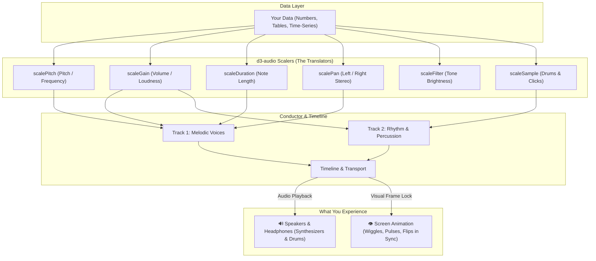
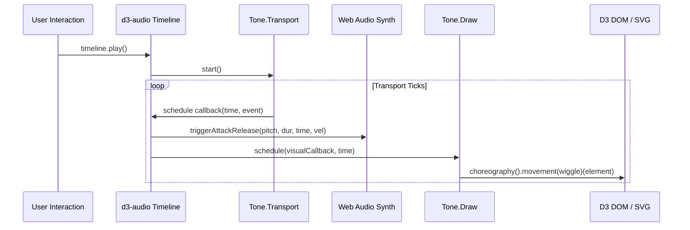

# d3-audio 🎵⚡

> **Audio-Visual Data Sonification and Rhythmic Choreography for D3.js and Tone.js**

[](LICENSE)
[](https://dmuldrew.github.io/d3_audio/)
[](#-unit-tests--verification)
[](#-running-with-docker)
[](https://d3js.org/)
[](https://tonejs.github.io/)

**What if you could *hear* your data the same way you see it?**

Think of a hospital heart monitor beeping in tempo with a pulse, a car's parking sensors beeping faster as you back closer to an obstacle, or a microwave chiming when food is hot. We all use sound every day to understand what is happening without having to stare at a screen.

`d3-audio` brings this power to web data visualization. Just as tools like **D3.js** turn numbers into bar heights, circles, and line graphs on your screen, `d3-audio` translates those same numbers into musical notes, rhythms, volume, and stereo sound—while keeping on-screen animations moving in perfect lockstep with the audio.

> 🌐 **Live Interactive Showcase**: Experience the full suite of **21 interactive sonification applications** running live in your browser at **[https://dmuldrew.github.io/d3_audio/](https://dmuldrew.github.io/d3_audio/)**!

---

## 📑 Table of Contents

- [What is Data Sonification? (A Plain-English Intro)](#-what-is-data-sonification-a-plain-english-intro)
- [Conceptual Model & Architecture](#-conceptual-model--architecture)
- [Principles of Data Sonification](#-principles-of-data-sonification)
- [Continuous, Ordinal, and Categorical Data Sonification](#-continuous-ordinal-and-categorical-data-sonification)
- [Musical Tension, Release & Energy Dynamics](#-musical-tension-release--energy-dynamics)
- [Ethical Sonification Guidelines](#-ethical-sonification-guidelines--preventing-data-misrepresentation)
- [Cognitive Channels for Data Encoding](#-cognitive-channels-for-data-encoding)
- [Ecosystem, Prior Art & Academic References](#-ecosystem-prior-art--academic-references)
- [Key Features](#-key-features)
- [Quickstart Guide](#-quickstart-guide)
- [Interactive Demo Applications](#-interactive-demo-applications)
- [Interactive Audio Legend (`audioLegend`)](#-interactive-audio-legend-audiolegend)
- [D3 Audio Scalers Reference](#-d3-audio-scalers-reference)
  - [`scalePitch()`](#scalepitch)
  - [`scaleGain()`](#scalegain)
  - [`scaleDuration()`](#scaleduration)
  - [`scalePan()`](#scalepan)
  - [`scaleFilter()`](#scalefilter)
  - [`scaleSample()`](#scalesample)
  - [`scaleTempo()`](#scaletempo)
  - [`scaleTension()`](#scaletension)
  - [`scaleRhythm()`](#scalerhythm)
  - [`scaleUncertainty()`](#scaleuncertainty)
  - [`scaleSpatial()`](#scalespatial)
  - [`scaleEcho()`](#scaleecho)
  - [`scaleChord()`](#scalechord)
- [Rhythmic Movements & Choreography](#-rhythmic-movements--choreography)
  - [Movement Presets](#movement-presets)
  - [`choreography()` Engine](#choreography-engine)
  - [ADSR Motion Envelopes & Custom Physics](#adsr-motion-envelopes--custom-physics)
- [Timeline & Multi-Track Conductor](#-timeline--multi-track-conductor)
  - [`timeline()`](#timeline)
  - [`Track`](#track)
- [Audio Synthesis & Built-in Soundbanks](#-audio-synthesis--built-in-soundbanks)
- [Step-by-Step Recipes](#-step-by-step-recipes)
- [Running with Docker](#-running-with-docker)
- [Repository Structure](#-repository-structure)
- [Unit Tests & Verification](#-unit-tests--verification)

---

## 🎧 What is Data Sonification? (A Plain-English Intro)

**Data sonification** is the practice of turning information into sound.

When you look at a traditional bar chart, your eyes translate the height of each bar into a number—taller means more, shorter means less. With data sonification, your ears do the exact same thing:

* **Lower numbers** sound like deep, low notes (like a cello or bass).
* **Higher numbers** sound like bright, high notes (like a chime or flute).
* **Sudden spikes** can sound like a crisp drum click or an increase in volume.
* **Groups or categories** (like departments, countries, or animal species) can sound like distinct musical instruments playing together in harmony.

### Why Turn Data into Sound?

1. **Accessibility for Everyone**: Not everyone can easily read complex visual dashboards. For blind, low-vision, or neurodivergent analysts, traditional screen readers have to read raw spreadsheets cell-by-cell ("A1: 12.3, A2: 15.8, A3: 19.4..."), which is exhausting and slow. With sonification, an analyst can hear an entire 10-year trend or catch a dramatic drop in just two seconds.
2. **Eyes-Free Multitasking**: Your eyes can only focus on one screen at a time, but your ears can listen to the environment while you do other things. A server administrator, healthcare worker, or trader can listen to an ambient background audio stream and immediately notice when something changes pitch or rhythm.
3. **Catching What Your Eyes Miss**: The human ear is extraordinarily sensitive to rhythm, timing, and repetition. In a complex or crowded visual chart with dozens of crisscrossing lines, subtle periodic patterns or tiny wobbles get lost in visual clutter—yet your ears can spot a slight syncopation or missed beat instantly.
4. **Emotional Impact & Storytelling**: Numbers on a page can feel abstract and dry. Hearing a century of climate warming or biodiversity loss accelerate into tense, dissonant tones creates a memorable human connection that resonates far beyond a silent report.

---

## 🧠 Conceptual Model & Architecture

In traditional visual charts, you create a "scale" that maps numbers to screen pixels:

> **Data (0 to 100)** → *Visual Scale* → **Screen Pixels (0px to 500px)**

`d3-audio` adds a parallel bridge that maps those same numbers to sounds and synchronized motion:

> **Data (0 to 100)** → *Audio Scaler* → **Musical Notes (C3 to C6)**  
> **Data Event** → *Timeline Sync* → **Screen Motion (Wiggles, Bounces, Pulses)**



---

## 📜 Principles of Data Sonification

Data sonification is grounded in foundational principles of auditory display and psychoacoustics:

### 1. Mapping Data to Sound
> **Data + Clear Mapping = Meaning**  
> **Data + Unexplained Sounds = Noise**

Just as an unlabeled visual chart produces confusion, sound without an explanation is merely noise. A listener needs to know *what* they are hearing: *"Does higher pitch mean more sales, or higher risk?"*

`d3-audio` includes an interactive **`audioLegend()`** widget. Just like a color legend on a map, an Audio Legend displays the rules of the sonification and lets users click to audition each sound before playing the full visualization.

### 2. The Golden Rule of Sonification: Stay Close to the Data!
> *Stay close to the data... otherwise it's art!*

Music takes creative liberties, but **data sonification is an analytical tool**. Every rule of visual chart integrity has a direct auditory counterpart:

* **Truncated Y-Axis ➔ Exaggerated Pitch**: Starting a bar chart at 90 exaggerates a 1% blip into a huge spike; stretching a narrow metric across three wild octaves creates the same deception. Keep pitch spans proportional to real data changes.
* **Bubble Size vs. Volume Calibration**: In visual charts, accidentally scaling a circle's radius instead of its area makes a 2× increase look 4× bigger. In audio, human hearing perceives volume logarithmically rather than linearly. Always calibrate loudness using decibels (`scaleGain.db()`) so volume changes sound mathematically honest.
* **Visual Chartjunk ➔ Auditory "Audiojunk"**: Edward Tufte's *chartjunk* (decorative 3D bevels and visual clutter) has an audio cousin: gratuitous reverb, echo, and synth flourishes that obscure real numbers. Every sound must represent an actual data point.
* **Reading the Axes ➔ The Reconstruction Test**: If someone looks at an honest visual chart, they can read the axes and reconstruct the numbers. An honest sonification passes the same test: a listener, guided by an audio legend, can reconstruct the underlying trend from sound alone.

### 3. Categorical Integrity: Avoiding False Pitch Hierarchies
> **Never map unranked categories to higher and lower pitches.**

The human brain instinctively hears higher musical notes as "higher," "better," "hotter," or "more important." In visual graphics, you would never represent unranked categories (like Engineering vs. Marketing, or Apples vs. Oranges) using an ordered vertical bar chart or a sequential heat ramp.

In sonification, if you assign Department A to a low C3 and Department B to a high C5, listeners will unavoidably perceive an implicit hierarchy or rank. Always reserve pitch for continuous quantities and ordinal rankings; use distinct **instrument timbres** (piano vs. flute vs. marimba) or **stereo pan positions** for unranked categories.

---

## 📊 Continuous, Ordinal, and Categorical Data Sonification

In data analysis, different types of data require different visual charts. In data sonification, they require different kinds of sound:

| Data Type | Everyday Analogy | Best Visual Element | Best Auditory Element (`d3-audio` Scaler) |
|---|---|---|---|
| **Continuous (Smooth Numbers)** | Thermometer temperature, vehicle speed, stock price | Line height, bar length | **Pitch & Frequency** (`scalePitch`), **Volume** (`scaleGain`), **Left/Right Pan** (`scalePan`) |
| **Ordinal (Ranked Steps)** | Gold/Silver/Bronze medals, spicy hot-sauce tiers, survey stars (1 to 5) | Ordered rows, brightness tiers | **Musical Scale Steps** (`scalePitch` quantized to Do-Re-Mi), **Harmonic Tension** (`scaleTension`) |
| **Categorical (Unranked Groups)** | Fruit types (Apples, Oranges, Pears), departments, countries | Distinct colors (Red, Blue, Green) | **Instrument Timbres** (Piano vs. Marimba vs. Flute), **Drum Hits** (`scaleSample`) |

### 1. Continuous Data: "Smoothly Sliding Values"
* **What it is**: Quantities that can vary smoothly by fractions—like temperature rising from 68.1°F to 72.4°F, or water pressure rising.
* **How to sonify it**: Use continuous pitch glides, rising volume, or stereo panning (panning from left to right as a timeline advances).
* **Tools**: `scalePitch().quantize(false)`, `scaleGain()`, `scalePan()`, `scaleFilter()`.

### 2. Ordinal Data: "Climbing Steps"
* **What it is**: Values that have a strict, meaningful order, but aren't necessarily exact measurements—such as Olympic medals, threat levels (Low, Moderate, High, Severe), or customer satisfaction ratings.
* **How to sonify it**: Use ascending musical steps (like climbing a major or pentatonic musical scale: C, D, E, G, A), octave registers, or progression from calm chords to tense chords.
* **Tools**: `scalePitch().quantize(true)`, `scaleTension()`.

### 3. Categorical Data: "Distinct Buckets"
* **What it is**: Discrete categories that have **no natural higher-or-lower ranking**—like product categories, departments (Sales, Engineering, Support), or animal species.
* **How to sonify it**: Assign each category a completely distinct **instrument voice** or percussion hit:
  * Department A → Warm Piano
  * Department B → Bright Marimba
  * Department C → Acoustic Guitar
* **Tools**: `scaleSample()`, multi-instrument timbre routing, `scalePan()`.

---

## ⚡ Musical Tension, Release & Energy Dynamics

In movie scores, a composer builds suspense with tense, eerie chords before resolving into a peaceful, stable melody. In data sonification, you can use that exact same psychological response to communicate risk, volatility, and equilibrium:

* **Tension (Instability & Risk)**: Created using dissonant harmonic intervals (notes that intentionally clash, like a tritone), faster tempos, or distorted textures. Use this when a metric breaches safety thresholds, or when market volatility surges.
* **Release (Stability & Resolution)**: Returning to smooth, pleasant harmonies (like major chords) when metrics return to normal operating boundaries.
* **Energy**: Combining loudness with tempo:
  > **Perceived Energy = Loudness × Speed (Tempo)**
* **`scaleTension()`**: A unified scaler that coordinates harmonic dissonance, filter brightness, and playback speed from a single risk or volatility number.

---

## ⚖️ Ethical Sonification Guidelines & Preventing Data Misrepresentation

Sound has a direct line to human emotion. Because of that, sound designers have a responsibility to present data honestly:

1. **Beware the "Sugarcoated Scale"**: If you map chaotic, failing system metrics onto a universally sweet pentatonic scale (the notes of a pleasant lullaby), the disaster will sound cheerful and calm! When data is bad or volatile, allow it to sound tense or dissonant.
2. **Watch Cultural Biases in Chords**: In Western culture, minor chords often feel "sad" or "mysterious," while major chords feel "happy." Avoid using minor chords for neutral groups (like regions or demographic categories) unless you are truly representing a positive vs. negative change (like profits vs. losses).
3. **Equal Loudness Across Registers**: Human ears hear middle pitches (like human speech, around 2,000 to 4,000 Hz) much louder than deep bass or ultra-high treble. Calibrate volume so high notes don't deafen the listener while low bass notes fade into inaudibility.
4. **Don't Overcrowd the Ears**: Triggering more than 20 notes per second causes individual sounds to blend together into an indistinct buzz. Keep events spaced so each data point can be clearly heard.

---

## 🧠 Cognitive Channels for Data Encoding

Different auditory attributes engage different neurological processing pathways. Leverage each channel according to its cognitive strength:

| Musical Dimension | Cognitive Channel | Optimal Data Mapping Application |
|---|---|---|
| **Time & Rhythm** | Temporal Pacing | Chronological sequence, historical progression, relative speed/urgency. |
| **Pitch Register** | Vertical Spatialization | High/Low magnitude, altitude, temperature, focal depth, priority. |
| **Melody & Contour** | Cognitive Memorability | Constructing melodic "earworms" that enable users to identify and remember complex data patterns. |
| **Tonal Harmony** | Emotional Resonance | System health, volatility tension, policy resolution, equilibrium states. |
| **Timbre & Texture** | Categorical Discrimination | Unranked qualitative categories, discrete taxonomic groups, multi-source streams. |
| **Stereo Panning** | Lateral Spatialization | Geographical longitude, physical array memory indices, flow directions. |

---

## 📚 Ecosystem, Prior Art & Academic References

`d3-audio` builds upon pioneering work in the fields of auditory display, sound art, and algorithmic musicology:

* **Pioneering Sonification Projects**:
  * **Timo Bingmann** (*"The Sound of Sorting — A Sorting Algorithm Visualization and Audibilization Tool"*, 2013, Panthema / Karlsruhe Institute of Technology): The landmark open-source tool and audibilization study demonstrating the acoustic signatures of Quicksort, Mergesort, Radix Sort, and other comparison algorithms by mapping array values to musical pitch and memory access indices to stereo panning.
  * **Ronald M. Baecker** (*"Sorting Out Sorting"*, 1981, ACM SIGGRAPH / University of Toronto): The foundational 30-minute educational color sound film that pioneered computer-assisted sorting algorithm audio-visual demonstration.
  * **Brian Foo** (*Data-Driven DJ*): Landmark sonification mapping median household income inequality along the NYC Subway F-Train line to musical arrangements.
  * **Dr. Mark Ballora** (Penn State University): Scientific acoustic data sonification of tropical storms, including the physiological and atmospheric parameters of *Hurricane Sandy*.
  * **Johannes Kreidler** (*Charts Music*): Algorithmic stock market crash melodies mapping 2008 Lehman Brothers, General Motors, and Bank of America declines into acoustic chamber instruments.
  * **Reveal News & Center for Investigative Reporting**: *The Music of Oklahoma's Earthquakes*, sonifying the dramatic rise of human-induced seismic activity linked to wastewater injection.
* **Historical Libraries & Tooling**:
  * `miditime` (Python): Musical data sonification utility for converting numeric sequences into standard MIDI files.
  * `Tone.js`: Web Audio framework powering modern browser synthesis and timeline scheduling.
  * `Heartbeat.js` & `Midi.js`: Early web-based MIDI synthesis engines.
  * **Thomas Levine**: Open-source R package and tutorials for rendering datasets directly into music videos and audio tracks.

---

## 🌟 Key Features

- **Musical Intelligence & Quantization**: Built-in awareness of Western diatonic modes (Major, Minor, Dorian, Phrygian, Lydian, Mixolydian, Locrian), Pentatonic scales, Blues scales, Symmetrical scales (Whole Tone, Diminished, Chromatic), World scales (Japanese Insen/Hirajoshi, Indian Raga Bhairav, Arabic Double Harmonic), and chords (Maj7, Min7, Dom7). Continuous data snaps cleanly to harmonic scale degrees or glides microtonally.
- **Frame-Accurate Audio-Visual Sync**: Uses `Tone.Draw.schedule()` to trigger DOM/SVG/Canvas visual updates on the exact render frame aligned with Web Audio hardware buffers, eliminating perceptual lag.
- **Physics-Based Kinetic Presets**: Out-of-the-box support for wiggles, 3D perspective flips, scale pulses, gravitational bounces, tremors/shakes, expanding shockwave ripples, and squash & stretch dynamics.
- **Zero External Audio Assets Required**: Includes synthesized acoustic/808 drum and percussion sound models (kick, snare, hi-hats, claps, toms, bells, blips) so all examples and sonifications work instantly offline without downloading multi-megabyte soundbanks.
- **Direct D3 Idioms**: Fluent chaining syntax, getter/setter functions, `.domain()`, `.range()`, and `d3.selection.call()` integration.

---

## 🚀 Quickstart Guide

### 1. Include in HTML

You can load `d3-audio` directly from the `dist/` bundle alongside D3 and Tone.js:

```html
<!DOCTYPE html>
<html>
<head>
  <!-- 1. Load D3 and Tone.js from CDN -->
  <script src="https://cdn.jsdelivr.net/npm/d3@7"></script>
  <script src="https://cdnjs.cloudflare.com/ajax/libs/tone/15.0.4/Tone.js"></script>

  <!-- 2. Load d3-audio bundle -->
  <script src="/dist/d3-audio.js"></script>
</head>
<body>
  <button id="play-btn">▶ Play Sonification</button>
  <svg id="chart" width="800" height="400"></svg>

  <script>
    const dataset = [
      { id: 1, x: 50,  val: 20, urgency: 1.0 },
      { id: 2, x: 200, val: 55, urgency: 2.5 },
      { id: 3, x: 450, val: 85, urgency: 4.0 },
      { id: 4, x: 700, val: 40, urgency: 1.8 }
    ];

    // 1. Create D3 SVG visual elements
    const svg = d3.select("#chart");
    const circles = svg.selectAll("circle")
      .data(dataset)
      .enter()
      .append("circle")
      .attr("cx", d => d.x)
      .attr("cy", d => 350 - d.val * 3)
      .attr("r", 24)
      .attr("fill", "#38bdf8");

    // 2. Define Audio Scalers
    const pitch = d3Audio.scalePitch()
      .domain([0, 100])
      .range(["C3", "C6"])
      .scale("pentatonic")
      .root("C");

    const pan = d3Audio.scalePan()
      .domain([0, 800])
      .range([-0.9, 0.9]);

    // 3. Connect to Tone.js Timeline & Choreography
    const tl = d3Audio.timeline({ bpm: 120, loop: true })
      .data(dataset)
      .time((d, i) => i * 0.5) // time offset in seconds or Tone notation
      .pitch(d => pitch(d.val))
      .pan(d => pan(d.x))
      .movement((d, i) => ({
        movement: d.urgency > 3.0 ? "wiggle" : "pulse",
        intensity: d.urgency / 2.0,
        element: circles.nodes()[i]
      }));

    document.getElementById("play-btn").addEventListener("click", async () => {
      await tl.play();
    });
  </script>
</body>
</html>
```

---

## 🎮 Interactive Demo Applications & GitHub Pages Hosting

The repository includes **21 interactive applications** demonstrating different sonification and choreography patterns.

### 🌐 Live Deployment on GitHub Pages
The entire interactive demo gallery and documentation is hosted live at:
👉 **[https://dmuldrew.github.io/d3_audio/](https://dmuldrew.github.io/d3_audio/)**

* **Automated CI/CD**: A GitHub Actions workflow (`.github/workflows/deploy-pages.yml`) publishes the site automatically on every push to `main`.
* **Zero Configuration**: Static hosting ready with `.nojekyll` and modular relative imports.

### 🐳 Local Docker Server
To run locally inside Docker:
```bash
docker compose up
```
Or open [http://localhost:3000](http://localhost:3000) in your browser.

| Demo | Live Web App | Source Code | Description |
|---|---|---|---|
| **Overview Hub** | [Launch Hub ➔](https://dmuldrew.github.io/d3_audio/) | [`index.html`](index.html) | Interactive launchpad with live sound nodes and feature cards. |
| **01. Data Sonifier & Chart** | [Launch Demo ➔](https://dmuldrew.github.io/d3_audio/examples/01-data-sonification/) | [`examples/01-data-sonification/`](examples/01-data-sonification/) | Multi-variable scatter & bar chart with pitch, stereo pan, duration scaling, and synchronized visual playhead tracking. |
| **02. Motion Matrix Sequencer** | [Launch Demo ➔](https://dmuldrew.github.io/d3_audio/examples/02-rhythmic-sequencer/) | [`examples/02-rhythmic-sequencer/`](examples/02-rhythmic-sequencer/) | 16-step 4-track sequencer triggering drum samples and synth bass with coordinated wiggles, 3D flips, bounces, and ripples. |
| **03. Continuous Stream & Sweeps** | [Launch Demo ➔](https://dmuldrew.github.io/d3_audio/examples/03-continuous-stream/) | [`examples/03-continuous-stream/`](examples/03-continuous-stream/) | Live time-series stream with audio filter frequency sweeps, spatial stereo audio, and responsive particle dynamics. |
| **04. Scaler & Choreography Playground** | [Launch Demo ➔](https://dmuldrew.github.io/d3_audio/examples/04-playground/) | [`examples/04-playground/`](examples/04-playground/) | Interactive workbench to test scale modes, movement presets, and copy live generated D3 code. |
| **05. Radial Sunburst & Cyclic Radar** | [Launch Demo ➔](https://dmuldrew.github.io/d3_audio/examples/05-radial-sunburst/) | [`examples/05-radial-sunburst/`](examples/05-radial-sunburst/) | Multi-tier radial partition chart with rotating radar needle triggering cyclic arpeggios, octave tiers, and kinetic radial pulses. |
| **06. Force Network & Graph Sonifier** | [Launch Demo ➔](https://dmuldrew.github.io/d3_audio/examples/06-network-graph/) | [`examples/06-network-graph/`](examples/06-network-graph/) | D3 Force physics network graph where node degree maps to harmonic pitch, drag-and-release plucks strings, and impulses traverse edges polyphonically. |
| **07. Geographic Map & Spatial 2D Audio** | [Launch Demo ➔](https://dmuldrew.github.io/d3_audio/examples/07-geographic-map/) | [`examples/07-geographic-map/`](examples/07-geographic-map/) | World map sonifying longitude as stereo panning [-1, +1] and latitude as pitch register, with animated flight route tour and bouncing city beacons. |
| **08. Streamgraph & Harmonic Chord Voicer** | [Launch Demo ➔](https://dmuldrew.github.io/d3_audio/examples/08-streamgraph/) | [`examples/08-streamgraph/`](examples/08-streamgraph/) | Stacked area streamgraph of energy sources where each undulating layer is an independent harmonic voice playing 5-note polyphonic chords. |
| **09. Treemap & Hierarchical Market** | [Launch Demo ➔](https://dmuldrew.github.io/d3_audio/examples/09-treemap-matrix/) | [`examples/09-treemap-matrix/`](examples/09-treemap-matrix/) | Multi-sector stock market treemap mapping market cap to duration/gain and performance (+/-) to Major vs Minor modes with automated tile scanning. |
| **10. Circular Chord Diagram & Flows** | [Launch Demo ➔](https://dmuldrew.github.io/d3_audio/examples/10-chord-diagram/) | [`examples/10-chord-diagram/`](examples/10-chord-diagram/) | Directional bilateral matrix flows connecting regions with dual-note chord intervals, spatial angular panning, and shockwave ribbon ripples. |
| **11. Ridgeline Joyplot Topography** | [Launch Demo ➔](https://dmuldrew.github.io/d3_audio/examples/11-ridgeline-joyplot/) | [`examples/11-ridgeline-joyplot/`](examples/11-ridgeline-joyplot/) | Topographic probability distributions scanning pitch frequencies and filter cutoffs while curves vibrate dynamically like resonant strings. |
| **12. Particle Flow Field Swarm** | [Launch Demo ➔](https://dmuldrew.github.io/d3_audio/examples/12-particle-flowfield/) | [`examples/12-particle-flowfield/`](examples/12-particle-flowfield/) | 200+ autonomous particles flowing through a vector curl field with interactive vortex attractors generating ambient polyphonic soundscapes. |
| **13. Seismic Simon Earthquake Game** | [Launch Demo ➔](https://dmuldrew.github.io/d3_audio/examples/13-pie-simon-earthquake/) | [`examples/13-pie-simon-earthquake/`](examples/13-pie-simon-earthquake/) | Educational "Simon Says" memory game using real USGS earthquake data where pie slices sonify tectonic depth and magnitude with shockwave ripples. |
| **14. Exoplanet Orbit & Doppler Symphony** | [Launch Demo ➔](https://dmuldrew.github.io/d3_audio/examples/14-exoplanet-doppler/) | [`examples/14-exoplanet-doppler/`](examples/14-exoplanet-doppler/) | NASA Kepler & TRAPPIST-1 orbital physics lab where Kepler's 3rd law generates orbital frequencies, transit chimes, and Doppler stereo panning. |
| **15. Climate Spiral & Carbon Quest** | [Launch Demo ➔](https://dmuldrew.github.io/d3_audio/examples/15-climate-rhythm-quest/) | [`examples/15-climate-rhythm-quest/`](examples/15-climate-rhythm-quest/) | NASA temperature anomaly spiral (1880–2026) sonifying global warming as harmonic tension and policy scenarios as equilibrium resolution. |
| **16. Galton Board & Plinko Statistics** | [Launch Demo ➔](https://dmuldrew.github.io/d3_audio/examples/16-galton-board-plinko/) | [`examples/16-galton-board-plinko/`](examples/16-galton-board-plinko/) | Interactive Central Limit Theorem pinball where binomial random drops play acoustic marimba chimes and accumulate into a singing Gaussian bell curve. |
| **17. Protein & DNA Folding Sonifier** | [Launch Demo ➔](https://dmuldrew.github.io/d3_audio/examples/17-protein-dna-sonifier/) | [`examples/17-protein-dna-sonifier/`](examples/17-protein-dna-sonifier/) | Macromolecular ribbon folding with 20 amino acid categorical timbres, Kyte-Doolittle hydropathy spatial panning, and interactive audio legend. |
| **18. Categorical Ecosystem Food Web** | [Launch Demo ➔](https://dmuldrew.github.io/d3_audio/examples/18-ecosystem-taxonomy/) | [`examples/18-ecosystem-taxonomy/`](examples/18-ecosystem-taxonomy/) | Categorical trophic level timbres (Producers, Herbivores, Carnivores, Apex, Decomposers), biome modes, and IUCN conservation risk tension scaling. |
| **19. The Sound of Sorting Algorithms** | [Launch Demo ➔](https://dmuldrew.github.io/d3_audio/examples/19-sound-of-sorting/) | [`examples/19-sound-of-sorting/`](examples/19-sound-of-sorting/) | Auditory computer science laboratory sonifying Quicksort, Mergesort, Radix Sort LSD, Bubble Sort, and Insertion Sort with stereo memory array panning (citing Timo Bingmann's *The Sound of Sorting*, 2013). |
| **20. Advanced Scalers & Multivariate Sound Lab** | [Launch Demo ➔](https://dmuldrew.github.io/d3_audio/examples/20-advanced-scalers/) | [`examples/20-advanced-scalers/`](examples/20-advanced-scalers/) | Interactive testbed for statistical confidence bit-crushing (16➔2b), 3D spatial room reverb, network latency feedback echo, and multivariate harmonic triad voicings. |
| **21. Euclidean Polyrhythms & Groove Engine** | [Launch Demo ➔](https://dmuldrew.github.io/d3_audio/examples/21-euclidean-rhythms/) | [`examples/21-euclidean-rhythms/`](examples/21-euclidean-rhythms/) | Bjorklund algorithm polyrhythm visualizer with rotating concentric clockwork radar, multi-track server load sonification, and authentic world rhythm presets. |

---

## 🎛️ D3 Audio Scalers Reference

All scalers follow the fluent builder pattern and can be cloned with `.copy()`.

### `scalePitch()`
Maps continuous numeric domains or categorical values to musical pitches, frequencies (Hz), or MIDI note numbers.

```javascript
const pitch = d3Audio.scalePitch()
  .domain([0, 100])          // Input data domain
  .range(["C3", "C6"])       // Pitch bounds (scientific pitch notation)
  .scale("pentatonic")       // Scale mode (see table below)
  .root("C")                 // Root key ("C", "D", "Eb", "F#", etc.)
  .quantize(true)            // true = snap to scale degrees; false = continuous microtonal
  .clamp(true);              // Clamp domain inputs

pitch(50);             // Returns note string: "G4"
pitch.frequency(50);   // Returns frequency in Hz: 392.00
pitch.midi(50);        // Returns MIDI number: 67
pitch.notes();         // Returns array of all available scale notes in range
pitch.ticks(5);        // Returns sample domain ticks with note and frequency metadata
```

#### Supported Musical Scales & Modes

| Scale Name | Semitone Intervals | Characteristics |
|---|---|---|
| `pentatonic` / `pentatonicMajor` | `[0, 2, 4, 7, 9]` | Universally consonant, bright, harmonious |
| `pentatonicMinor` | `[0, 3, 5, 7, 10]` | Bluesy, moody, universally consonant |
| `major` / `ionian` | `[0, 2, 4, 5, 7, 9, 11]` | Standard diatonic major scale |
| `minor` / `naturalMinor` | `[0, 2, 3, 5, 7, 8, 10]` | Standard natural minor (Aeolian mode) |
| `harmonicMinor` | `[0, 2, 3, 5, 7, 8, 11]` | Classical minor with raised 7th leading tone |
| `melodicMinor` | `[0, 2, 3, 5, 7, 9, 11]` | Jazz minor ascending scale |
| `blues` | `[0, 3, 5, 6, 7, 10]` | Expressive with blue note (diminished 5th) |
| `dorian` | `[0, 2, 3, 5, 7, 9, 10]` | Minor mode with bright major 6th (jazzy) |
| `phrygian` | `[0, 1, 3, 5, 7, 8, 10]` | Exotic, flamenco-style minor with flat 2nd |
| `lydian` | `[0, 2, 4, 6, 7, 9, 11]` | Dreamy major mode with raised 4th |
| `mixolydian` | `[0, 2, 4, 5, 7, 9, 10]` | Dominant major mode with flat 7th |
| `locrian` | `[0, 1, 3, 5, 6, 8, 10]` | Highly tense, diminished 5th mode |
| `wholeTone` | `[0, 2, 4, 6, 8, 10]` | Dreamy, symmetrical, impressionistic |
| `chromatic` | `[0, 1, 2, ..., 11]` | All 12 semitones |
| `insen` | `[0, 1, 5, 7, 10]` | Traditional Japanese pentatonic mode |
| `hirajoshi` | `[0, 2, 3, 7, 8]` | Traditional Japanese koto scale |
| `bhairav` / `arabic` | `[0, 1, 4, 5, 7, 8, 11]` | Double harmonic major, raga Bhairav |
| `maj7` / `min7` / `dom7` | Chord subsets | Arpeggio chord voicings |

---

### `scaleGain()`
Maps data to volume / gain amplitude `[0.0, 1.0]` or decibels `[-60, 0]`.

```javascript
const gain = d3Audio.scaleGain()
  .domain([0, 1000])
  .range([0.1, 1.0])
  .curve("perceptual")       // "linear", "exponential", "logarithmic", "perceptual"
  .exponent(2.0)             // Custom exponent for "exponential" curve
  .clamp(true);

gain(500);     // -> ~0.64 (linear gain)
gain.db(500);  // -> ~-3.87 dB
```

---

### `scaleDuration()`
Maps data to rhythmic subdivisions or duration in seconds.

```javascript
const duration = d3Audio.scaleDuration()
  .domain([0, 100])
  .range(["16n", "1m"])      // Subdivision bounds ("32n", "16n", "8n", "4n", "2n", "1m")
  .quantize(true)            // true = snap to musical notation; false = continuous seconds
  .bpm(120);

duration(0);         // -> "16n"
duration(100);       // -> "1m"
duration.seconds(50);// -> 0.5 seconds
```

---

### `scalePan()`
Maps spatial coordinates to stereo panning `[-1.0 (Left), +1.0 (Right)]`.

```javascript
const pan = d3Audio.scalePan()
  .domain([0, svgWidth])
  .range([-1.0, 1.0])
  .clamp(true);

pan(0);              // -> -1.0 (Hard Left)
pan(svgWidth / 2);   // ->  0.0 (Center)
pan(svgWidth);       // -> +1.0 (Hard Right)
```

---

### `scaleFilter()`
Maps data to lowpass/highpass filter cutoff frequencies (Hz) and Q resonance.

```javascript
const filter = d3Audio.scaleFilter()
  .domain([0, 100])
  .range([200, 12000])       // Hz
  .qRange([1, 12])           // Q resonance factor
  .type("logarithmic");      // "logarithmic", "exponential", "linear"

filter(50);    // -> ~1549 Hz (logarithmic center)
filter.q(50);  // -> 6.5
```

---

### `scaleSample()`
Maps categorical or ordinal data to sound sample names or drum trigger IDs.

```javascript
const sample = d3Audio.scaleSample()
  .domain(["low", "medium", "high", "critical"])
  .range(["kick", "snare", "hihat", "bell"])
  .unknown("blip");

sample("critical");  // -> "bell"
sample("unmatched"); // -> "blip"
```

---

### `scaleTempo()`
Maps global or track metrics to transport playback speed in BPM.

```javascript
const tempo = d3Audio.scaleTempo()
  .domain([0, 100])
  .range([70, 160]);

tempo(50); // -> 115 BPM
```

---

### `scaleTension()`
Maps continuous anomaly, volatility, risk, or deviation metrics to multi-dimensional harmonic tension (consonance vs dissonance), filter cutoffs, tempo multipliers, and microtonal detuning cents.

```javascript
const tension = d3Audio.scaleTension()
  .domain([0, 100])             // Low baseline ➔ High volatility
  .root("C3")
  .tempoRange([1.0, 1.8])       // 1.0x baseline ➔ 1.8x accelerated panic
  .filterRange([400, 8000])     // Low dark ➔ High piercing resonance
  .detuneRange([0, 60]);        // Microtonal cents of dissonance

// Evaluate single data point:
const state = tension(85);
/* Returns:
{
  normalized: 0.85,
  tier: "dissonant",
  isDissonant: true,
  chord: ["C3", "F#3", "Bb3", "Db4"], // Dissonant tritone cluster
  filterCutoff: 6860,
  gain: 0.91,
  tempoMultiplier: 1.68,
  detuneCents: 51
}
*/

// Direct helper methods:
tension.chord(85); // ["C3", "F#3", "Bb3", "Db4"]
tension.tempo(85); // 1.68
tension.pitch(85); // Note string
```

---

### `scaleUncertainty()` / `scaleCrush()`
Maps statistical uncertainty, p-values, confidence interval widths, or missing data to `Tone.BitCrusher` bit reduction (16 bits down to 2 bits) and lo-fi saturation grit.

* **Pristine / High Confidence (p near 0)**: 16 bits, pure acoustic tone with 0% grit.
* **Heavy Uncertainty / Noisy (p near 1)**: 2 to 4 bits, heavily bit-crushed, lo-fi digital crunch.

```javascript
const uncertainty = d3Audio.scaleUncertainty()
  .domain([0, 1])               // 0 = 0% error (certain), 1 = 100% error (uncertain)
  .range([16, 2]);              // 16-bit pristine ➔ 2-bit heavy crunch

const res = uncertainty(0.85);
// res: { bits: 4, grit: 0.85, wet: 0.85, label: "Heavy Bit-Crushed (Uncertain)" }

// Pass directly into synthVoice:
synth.triggerAttackRelease("C4", "8n", undefined, 0.8, { crusher: res });
```

---

### `scaleSpatial()` / `scaleReverb()`
Maps 3D Z-depth, distance from camera, geographic distance from an epicenter, or cluster hierarchy to reverberant acoustic space (`Tone.Reverb` / `Tone.Freeverb`).

* **Near / Foreground**: Dry, intimate, in-your-face (5% wet, 0.4s decay).
* **Far / Background**: Cavernous, deeply reverberant (95% wet, 7.0s decay).

```javascript
const spatial = d3Audio.scaleSpatial()
  .domain([0, 100])             // 0 = near, 100 = distant
  .range([0.05, 0.95]);         // Wet mix

const { wet, decay } = spatial(zDistance);
```

---

### `scaleEcho()` / `scaleDelay()`
Maps rolling moving-average windows, network latency, or memory inertia to `Tone.FeedbackDelay` parameters.

```javascript
const echo = d3Audio.scaleEcho()
  .domain([0, 1000]);           // Ping / latency in ms

const { delayTime, feedback } = echo(latencyMs);
```

---

### `scaleChord()` / `scaleHarmony()`
Multivariate harmonic scaler converting multidimensional data records into voiced chords (triads, 7ths, 9ths, suspended, diminished) with support for inversions, open voicings, and drop-2 arranging.

```javascript
const chord = d3Audio.scaleChord();

// Evaluate tuple or object:
const result = chord({
  root: "C3",
  quality: "maj7",
  voicing: "open"
});
// result.notes: ["C3", "G3", "E4", "B4"]
// result.frequencies: [130.8, 196.0, 329.6, 493.9]
```

---

### `scaleRhythm()` & `euclideanRhythm()`
Computes **Euclidean rhythms** using the **Bjorklund algorithm**, evenly distributing active pulses across time subdivisions (e.g. E(3, 8) = Tresillo, E(5, 16) = Cinquillo). Maps continuous data density or event rates into grooving polyrhythms and Tone.js timing offsets.

```javascript
// Standalone Bjorklund algorithm:
d3Audio.euclideanRhythm(3, 8);
// -> [1, 0, 0, 1, 0, 0, 1, 0]

// D3-idiomatic rhythm scaler:
const rhythm = d3Audio.scaleRhythm()
  .domain([0, 100])
  .steps(16)
  .range([1, 16]);

const { pattern, density, events } = rhythm(activityLevel);
```

---

## ♿ Universal Accessible Chart Sonifier (`accessibleChart`)

A 1-line turn-key D3 component that equips any visualization with full accessibility (a11y) compliance:
* **Keyboard Navigation**: `ArrowLeft` / `ArrowRight` step through data points, `Home` / `End` jump to edges, `Spacebar` plays the entire chart.
* **Screen Reader Live Speech**: Injects an `aria-live="polite"` region announcing point coordinates, rank, and formatted values.
* **Auditory Earcons**: Automatically triggers bright high chimes on **Peak Maximums** and deep low thuds on **Lowest Minimums**.

```javascript
import { accessibleChart } from "d3-audio";

d3.select("#my-chart-box").call(accessibleChart({
  data: dataset,
  x: d => d.date,
  y: d => d.price,
  label: (d, i, total) => `Point ${i + 1} of ${total}: ${d.date}, $${d.price}`,
  onPoint: (d, i, note) => updatePlayhead(d, i)
}));
```

---

## 🌍 World Musical Scales & Microtonality

`d3-audio` includes authentic non-Western musical scale systems and quarter-tone microtonality (±50 cents / half-flats):
* **Middle Eastern Maqams**: `maqamBayati` (with E~ quarter-tone), `maqamRast`, `maqamHijaz`, `maqamSaba`.
* **Indian Classical Ragas**: `ragaBhairav` (Komal Re, Komal Dha), `ragaTodi` (Tivra Ma), `ragaYaman` (Lydian), `ragaKafi` (Dorian).
* **Fractional Note Parsing**: `parseNote("E~4")` parses to exact fractional MIDI 63.5 and exact 320.24 Hz frequency.

---

## 🏷️ Interactive Audio Legend (`audioLegend`)

Implements the foundational data sonification principle:
> *"Communicate your data mapping to the user — just like you would label a graph!"*

`audioLegend` creates an interactive visual-auditory key that can be mounted into any HTML or D3 container. Each entry displays the data-to-sound rule and features a **🔊 "Test Sound"** button that lets listeners audition the auditory dimension (pitch range, volume change, stereo panning, or harmonic tension) before playing the chart:

```javascript
import * as d3 from "d3";
import { audioLegend, scalePitch, scaleGain, scalePan, scaleTension } from "d3-audio";

const legend = audioLegend()
  .title("Earthquake Seismic Audio Key")
  .pitch(depthPitchScale, "Tectonic Depth (0 – 700 km)")
  .gain(magnitudeGainScale, "Magnitude (3.0 – 9.0 Mw)")
  .pan(longitudePanScale, "Longitude (West ↔ East)")
  .tension(seismicTensionScale, "Tectonic Volatility Risk");

// Mount to DOM using standard D3 selection.call:
d3.select("#legend-container").call(legend);
```

---

## 💃 Rhythmic Movements & Choreography

`d3-audio` includes a physics-based animation engine designed to give visual elements kinetic feedback synchronized to sound triggers.

### Movement Presets

```javascript
import { wiggle, flip, pulse, bounce, shake, ripple, glow, squash } from "d3-audio";
```

| Preset | Visual Effect | Configurable Options |
|---|---|---|
| `wiggle` | Rotational & positional wobble with damped decay | `intensity`, `angle` (deg), `frequency` (cycles), `decay`, `mode` (`"rotate"` \| `"translate"` \| `"both"`) |
| `flip` | 3D perspective flip and spin | `intensity`, `axis` (`"y"` \| `"x"` \| `"scaleX"` \| `"scaleY"`), `degrees` (180, 360) |
| `pulse` | Radial scale pop with punchy attack | `intensity`, `maxScale` (e.g. 1.4) |
| `bounce` | Spring rebound with gravity damping | `intensity`, `height` (px), `direction` (`"up"` \| `"down"` \| `"left"` \| `"right"`) |
| `shake` | High-frequency jitter / tremor | `intensity`, `distance` (px), `frequency`, `axis` (`"x"` \| `"y"` \| `"random"`) |
| `ripple` | Concentric expanding halo shockwave | `intensity`, `maxRadius` (scale multiplier) |
| `glow` | Color bloom and drop-shadow burst | `intensity`, `color` (`"#38bdf8"`) |
| `squash` | Squash & stretch impact dynamics | `intensity`, `direction` (`"vertical"` \| `"horizontal"`) |

---

### `choreography()` Engine

The `choreography()` function integrates directly with D3 selections or standalone DOM/SVG elements:

```javascript
import { choreography } from "d3-audio";

// 1. Direct invocation on D3 Selection
d3.selectAll(".chart-bar")
  .call(choreography()
    .movement("wiggle")
    .intensity(d => d.value / 20)
    .duration(0.35)
  );

// 2. Programmatic trigger on single element
const choreo = choreography().movement("flip").duration(0.5);
choreo.trigger(document.getElementById("my-card"), { degrees: 360 });

// 3. Lifecycle hooks
choreography()
  .movement("bounce")
  .onStart((el, datum) => console.log("Started", datum))
  .onProgress((t, frame) => { /* custom per-frame render */ })
  .onEnd((el, datum) => console.log("Finished"))(myElement);
```

---

### ADSR Motion Envelopes & Custom Physics

You can author custom movements using built-in motion envelopes:

```javascript
import { adsrEnvelope, dampedOscillation, easings } from "d3-audio";

// Custom motion generator
function myCustomMorph(t, options = {}) {
  const amp = adsrEnvelope(t, { attack: 0.1, decay: 0.2, sustain: 0.4, release: 0.3 });
  const osc = dampedOscillation(t, 4, 3);
  
  return {
    transform: `translateY(${-amp * 30}px) rotate(${osc * 15}deg)`,
    opacity: 1.0 - t * 0.2
  };
}

// Use directly in choreography
choreography().movement(myCustomMorph).duration(0.6)(myElement);
```

---

## ⏱️ Timeline & Multi-Track Conductor

The `Timeline` conductor connects data arrays to Tone.js `Transport` and provides event dispatching.



### `timeline()`

```javascript
import { timeline } from "d3-audio";

const tl = timeline({
  bpm: 128,             // Beats per minute
  loop: true,           // Loop playback
  loopStart: 0,
  loopEnd: "4m",        // 4 measures
  timeSignature: [4, 4]
});

// Single track convenience API
tl.data(myDataset)
  .time((d, i) => `0:${Math.floor(i / 4)}:${i % 4}`)
  .pitch(d => pitchScale(d.value))
  .gain(d => gainScale(d.volume))
  .pan(d => panScale(d.x))
  .duration(d => durationScale(d.duration))
  .movement((d, i) => ({
    movement: "wiggle",
    intensity: d.value / 10,
    element: d3.select(`#node-${i}`)
  }));

// Playback controls
await tl.play();
tl.pause();
tl.stop();
tl.seek(2.5); // seek to 2.5s
tl.bpm(140);  // dynamic tempo change

// Event listeners
tl.on("step", ({ event, time, track }) => { ... });
tl.on("progress", ({ seconds, position, progress }) => { ... });
tl.on("start", () => { ... });
tl.on("pause", () => { ... });
tl.on("stop", () => { ... });
```

---

### `Track`

Create complex layered compositions with independent tracks (e.g. Lead Synth, Bass, Drums):

```javascript
// Track 1: Melodic Lead
const leadTrack = tl.track("lead", { type: "synth", synthType: "polySynth" })
  .data(leadData)
  .time(d => d.time)
  .pitch(d => pitchScale(d.val));

// Track 2: Synthesized 808 Drums
const drumTrack = tl.track("drums", { type: "sample" })
  .data(drumData)
  .time(d => d.time)
  .sample(d => d.sound); // "kick", "snare", "hihat"

// Track controls
drumTrack.mute(false);
leadTrack.solo(false);
```

---

## 🔊 Audio Synthesis & Built-in Soundbanks

`d3-audio` manages audio contexts, master effects chains, and instrument voices automatically.

### Master Sound Engine (`SoundEngine`)
- **Limiter**: Built-in master brickwall limiter to prevent digital clipping distortion.
- **Filter**: Master cutoff filter for dynamic sweeps.
- **Reverb & Delay**: Built-in master send/return spatial effects.
- **Autoplay Handling**: Safely initializes and resumes Web Audio context on the first user interaction:
  ```javascript
  import { defaultEngine } from "d3-audio";
  await defaultEngine.start();
  ```

### Instrument Synthesizers (`SynthVoice`)
Create custom synthesizer voices:
```javascript
import { createSynth } from "d3-audio";

const synth = createSynth({
  type: "fmSynth", // "polySynth", "fmSynth", "amSynth", "membraneSynth", "noiseSynth", "pluckSynth"
  harmonicity: 1.5,
  modulationIndex: 4,
  volume: -4,      // dB
  pan: 0.0,
  reverbSend: 0.2
});

synth.triggerAttackRelease("C4", "8n");
```

### Zero-Asset Drum Soundbank (`SamplePlayer`)
Built-in synthesized drum models ready without loading remote sound files:
```javascript
import { createSamplePlayer } from "d3-audio";

const player = createSamplePlayer();

player.trigger("kick", "8n");
player.trigger("snare", "8n");
player.trigger("hihat", "16n");
player.trigger("openhat", "8n");
player.trigger("clap", "16n");
player.trigger("tom", "8n", undefined, 0.8, { pitch: "A2" });
player.trigger("bell", "8n", undefined, 0.8, { pitch: "E5" });
player.trigger("blip", "32n", undefined, 0.8, { pitch: "C6" });

// Load custom audio files
await player.loadUrls({
  customKick: "/audio/kick.wav",
  customSnare: "/audio/snare.wav"
});
player.trigger("customKick");
```

---

## 🍳 D3 Sonification Cookbook & Practical Recipes

The following ready-to-use recipes illustrate production-ready patterns for integrating `d3-audio` into real-world data visualization applications.

---

### Recipe 1: Interactive Scrubbing & Pointer Hover on a D3 Line Chart
Provides continuous auditory feedback as the user scrubs their mouse across time-series coordinates, using smooth microtonal glissando pitch interpolation:

```javascript
import * as d3 from "d3";
import { scalePitch, scaleGain, createSynth, defaultEngine } from "d3-audio";

// 1. Configure smooth continuous pitch & gain scalers
const pitch = scalePitch()
  .domain([d3.min(data, d => d.price), d3.max(data, d => d.price)])
  .range(["C3", "C6"])
  .quantize(false); // Continuous microtonal gliding

const gain = scaleGain()
  .domain([0, d3.max(data, d => d.volume)])
  .range([0.2, 0.9]);

// 2. Synthesizer with portamento glide
const synth = createSynth({ type: "synth", portamento: 0.05, volume: -6 });

// 3. Pointer move listener on SVG chart overlay
d3.select("#chart-overlay")
  .on("pointerdown", async () => {
    await defaultEngine.start();
    synth.triggerAttack("C4");
  })
  .on("pointermove", function(event) {
    const [mx] = d3.pointer(event);
    const hoveredDatum = bisectDate(data, xScale.invert(mx));
    if (!hoveredDatum) return;

    // Smoothly glide frequency and volume to data point
    const freq = pitch.frequency(hoveredDatum.price);
    const vel = gain(hoveredDatum.volume);
    synth.setFrequency(freq, 0.04);
    synth.setVolume(vel);

    // Update visual tooltip & playhead
    updateTooltip(hoveredDatum, mx);
  })
  .on("pointerup pointerleave", () => {
    synth.triggerRelease();
  });
```

---

### Recipe 2: D3 Brush & Zoom Soundscapes
Provides intuitive acoustic feedback when selecting data intervals using `d3.brush()`, sonifying selection density and bounding box width:

```javascript
import * as d3 from "d3";
import { scalePitch, scalePan, scaleFilter, createSynth, defaultEngine } from "d3-audio";

const pan = scalePan().domain([0, width]).range([-0.8, 0.8]);
const filter = scaleFilter().domain([1, 500]).range([300, 7000]); // Density to brightness
const brushSynth = createSynth({ type: "fmSynth", volume: -8 });

const brush = d3.brushX()
  .extent([[0, 0], [width, height]])
  .on("start", async () => {
    await defaultEngine.start();
  })
  .on("brush", function({ selection }) {
    if (!selection) return;
    const [x0, x1] = selection;
    const center = (x0 + x1) / 2;
    const count = data.filter(d => xScale(d.date) >= x0 && xScale(d.date) <= x1).length;

    // Pan sound toward center of brush selection, open filter with item density
    const currentPan = pan(center);
    const currentCutoff = filter(count);
    brushSynth.triggerAttackRelease("G3", "16n", undefined, 0.6, {
      pan: currentPan,
      filterCutoff: currentCutoff
    });
  });

d3.select("#brush-g").call(brush);
```

---

### Recipe 3: Live Real-Time Streaming & WebSockets Telemetry
Sonifies continuous streaming telemetry without audio dropouts, clicks, or thread locking:

```javascript
import { scalePitch, scaleTension, createSynth, defaultEngine } from "d3-audio";

const tension = scaleTension().domain([0, 100]);
const synth = createSynth({ type: "polySynth", volume: -4 });

// Connect to incoming telemetry WebSocket
const socket = new WebSocket("wss://telemetry.example.com/live");

socket.onmessage = async (event) => {
  const metric = JSON.parse(event.data); // e.g. { cpu: 85, latency: 120 }
  await defaultEngine.start();

  const state = tension(metric.cpu);

  // If server is critical, trigger dissonant tension chord with sharp filter cutoff
  if (state.isDissonant) {
    synth.triggerAttackRelease(state.chord, "16n", undefined, state.gain, {
      filterCutoff: state.filterCutoff
    });
  } else {
    // Normal pulse
    synth.triggerAttackRelease(state.chord[0], "32n", undefined, 0.4);
  }
};
```

---

### Recipe 4: Accessible Screen-Reader Navigable Chart (a11y)
Enables blind and visually impaired users to step through data points with keyboard arrows, simultaneously receiving ARIA live announcements and audio cues:

```javascript
import * as d3 from "d3";
import { scalePitch, scaleGain, createSynth, defaultEngine } from "d3-audio";

const pitch = scalePitch().domain([0, 1000]).range(["C3", "C6"]).scale("pentatonic");
const synth = createSynth({ type: "synth", volume: -4 });
let activeIndex = 0;

function focusPoint(index) {
  activeIndex = Math.max(0, Math.min(data.length - 1, index));
  const d = data[activeIndex];
  const note = pitch(d.value);

  // 1. Play musical earcon
  synth.triggerAttackRelease(note, "8n");

  // 2. Announce to screen reader via ARIA live region
  const liveRegion = document.getElementById("sr-live-announce");
  liveRegion.textContent = `Point ${activeIndex + 1} of ${data.length}: Date ${d.date}, Value ${d.value} units.`;

  // 3. Highlight visual circle
  d3.selectAll(".data-dot").classed("active-focus", (item, i) => i === activeIndex);
}

// Keyboard navigation listener
window.addEventListener("keydown", async (e) => {
  if (e.key === "ArrowRight") {
    await defaultEngine.start();
    focusPoint(activeIndex + 1);
  } else if (e.key === "ArrowLeft") {
    await defaultEngine.start();
    focusPoint(activeIndex - 1);
  }
});
```

---

### Recipe 5: Custom Audio Sample Loading & Web Audio Soundfonts
Load custom `.wav` or `.mp3` sound assets for domain-specific sonifications (e.g. medical monitors or environmental bird calls):

```javascript
import { scaleSample, createSamplePlayer, defaultEngine } from "d3-audio";

const player = createSamplePlayer();

// 1. Preload custom audio assets
await player.loadUrls({
  heartbeat: "/assets/audio/heartbeat.wav",
  sonarPing: "/assets/audio/sonar.mp3",
  geigerClick: "/assets/audio/geiger.wav"
});

// 2. Map categorical events to custom samples
const sampleScale = scaleSample()
  .domain(["normal", "ping", "radiation"])
  .range(["heartbeat", "sonarPing", "geigerClick"]);

// 3. Trigger playback based on incoming event
async function onSensorEvent(eventType) {
  await defaultEngine.start();
  const sampleKey = sampleScale(eventType);
  player.trigger(sampleKey, "8n", undefined, 0.9);
}
```

---

## 🐳 Running with Docker

`d3-audio` is fully configured for containerized development and testing.

### 1. Build and Run Unit Tests
```bash
docker run --rm -v "$PWD":/app -w /app node:20-alpine sh -c "node scripts/build.js && node test/run-tests.js"
```

### 2. Run Interactive Showcase Server
```bash
docker compose up
```
Or with `docker run`:
```bash
docker run --rm -it -p 3000:3000 -v "$PWD":/app -w /app node:20-alpine node scripts/serve.js
```
Then visit **http://localhost:3000** in your browser.

---

## 📁 Repository Structure

```
d3_audio/
├── index.html                     # Master showcase hub & interactive live preview
├── package.json                   # Module metadata & scripts
├── Dockerfile                     # Docker container configuration
├── docker-compose.yml             # Docker compose service definition
├── dist/                          # Production builds
│   ├── d3-audio.js                # Standalone UMD / D3 bundle
│   └── d3-audio.min.js            # Minified distribution
├── src/
│   ├── index.js                   # Library root export & D3 namespace attachment
│   ├── musical/                   # Musical notes, pitch, frequency & scale algorithms
│   │   ├── notes.js
│   │   └── scales.js
│   ├── scales/                    # D3-style audio scalers
│   │   ├── scalePitch.js
│   │   ├── scaleGain.js
│   │   ├── scaleDuration.js
│   │   ├── scalePan.js
│   │   ├── scaleFilter.js
│   │   ├── scaleSample.js
│   │   ├── scaleTempo.js
│   │   └── scaleTension.js        # Multi-dimensional volatility & tension scaler
│   ├── ui/                        # Interactive audio keys & controls
│   │   └── audioLegend.js         # Interactive auditionable audio legend
│   ├── movements/                 # Rhythmic motion presets & choreography engine
│   │   ├── choreography.js
│   │   ├── motionEnvelope.js
│   │   └── presets/ (wiggle, flip, pulse, bounce, shake, ripple, glow, squash)
│   ├── audio/                     # Sound engine, synths & sample soundbanks
│   │   ├── soundEngine.js
│   │   ├── synthVoice.js
│   │   └── samplePlayer.js
│   └── timeline/                  # Tone.js transport & multi-track conductor
│       ├── timeline.js
│       └── track.js
├── examples/                      # 21 Interactive Demo Applications (01 through 21)
└── test/                          # Unit & integration test suite (130 passing tests)
```

---

## 🧪 Unit Tests & Verification

The test suite covers musical pitch/frequency conversion, all D3 audio scalers, all motion presets and physics envelopes, and multi-track timeline scheduling.

Run tests:
```bash
npm test
# Or with Docker:
docker run --rm -v "$PWD":/app -w /app node:20-alpine node test/run-tests.js
```

```
========================================
       d3-audio Unit Test Suite         
========================================

[1/4] Testing Musical Theory & Conversions...
  ✓ parseNote('C4') name is C
  ✓ parseNote('C4') octave is 4
  ✓ parseNote('C4') MIDI is 60
  ✓ parseNote('C4') frequency is ~261.63 Hz
  ✓ parseNote('A4') MIDI is 69
  ✓ parseNote('A4') frequency is 440 Hz
  ✓ parseNote('F#3') MIDI is 54
  ✓ parseNote('Bb5') MIDI is 82
  ✓ midiToNote(60) gives 'C4'
  ✓ frequencyToNote(440) gives 'A4'
  ✓ frequencyToMidi(440) gives 69
  ✓ transpose('C4', 7) is 'G4'
  ✓ transpose('C4', 12) is 'C5'
  ✓ transpose('C4', -12) is 'C3'
  ✓ Major scale has 7 notes
  ✓ Pentatonic scale has 5 notes
  ✓ Blues scale has 6 notes
  ✓ C Pentatonic notes between C4 and C5 match expected degrees
  ✓ Quantizing F#4 into C Pentatonic yields nearest scale note (E4 or G4)

[2/4] Testing D3-like Audio Scalers...
  ✓ scalePitch(0) gives C4
  ✓ scalePitch(100) gives C5
  ✓ scalePitch.frequency(0) is ~261.63 Hz
  ✓ scalePitch.midi(100) is 72
  ✓ Categorical pitch 'low' gives C3
  ✓ Categorical pitch 'high' gives C5
  ✓ scaleGain(0) is 0.2
  ✓ scaleGain(100) is 1.0
  ✓ scaleGain(50) is 0.6
  ✓ scaleGain.db(100) is 0 dB
  ✓ scaleDuration(0) is 16n
  ✓ scaleDuration(10) is 1m
  ✓ scaleDuration.seconds() returns numeric seconds
  ✓ scalePan(0) is -1 (Full Left)
  ✓ scalePan(400) is 0 (Center)
  ✓ scalePan(800) is 1 (Full Right)
  ✓ scaleFilter(0) is 200 Hz
  ✓ scaleFilter(100) is 10000 Hz
  ✓ scaleSample('crit') is 'crash'
  ✓ scaleSample('warn') is 'snare'
  ✓ scaleSample('info') is 'hihat'
  ✓ scaleTempo(0) is 60 BPM
  ✓ scaleTempo(100) is 160 BPM
  ✓ scaleTempo(50) is 110 BPM

[3/4] Testing Rhythmic Movements & Envelopes...
  ✓ PRESETS.wiggle exists
  ✓ PRESETS.flip exists
  ✓ PRESETS.pulse exists
  ✓ PRESETS.bounce exists
  ✓ PRESETS.shake exists
  ✓ PRESETS.ripple exists
  ✓ PRESETS.glow exists
  ✓ PRESETS.squash exists
  ✓ ADSR at t=0 is 0
  ✓ ADSR at t=1 is 0
  ✓ ADSR at peak attack is high
  ✓ Damped oscillation at t=0 is 0
  ✓ Damped oscillation at t=1 is 0
  ✓ Wiggle returns valid transform
  ✓ Wiggle rotation is numeric
  ✓ Flip rotateY at start is 0
  ✓ Flip rotateY at finish is 360
  ✓ Pulse scale at start is 1.0
  ✓ Pulse scale at peak is ~1.4
  ✓ Pulse scale at end is ~1.0
  ✓ Bounce returns translate transform
  ✓ Shake provides translateX
  ✓ Ripple scale at t=0 is 1.0
  ✓ Ripple opacity at t=0 is 1.0
  ✓ Ripple opacity at t=1 is 0.0
  ✓ Glow returns drop-shadow filter
  ✓ Squash scaleX at start is 1.0
  ✓ Squash scaleY at start is 1.0

[4/4] Testing Timeline & Track Orchestration...
  ✓ Timeline initialized with 130 BPM
  ✓ Timeline loop is true
  ✓ Timeline loopEnd is 2m
  ✓ Timeline default track holds 3 data points
  ✓ Built 3 scheduled events
  ✓ First event pitch is C4
  ✓ Second event pitch is E4
  ✓ Third event pitch is G4
  ✓ Third event gain is 1.0
  ✓ Timeline created 'drums' track
  ✓ Drums track holds 3 events

----------------------------------------
✔ ALL 130 TESTS PASSED SUCCESSFULLY!
```

---

## 📄 License

MIT License © 2026.